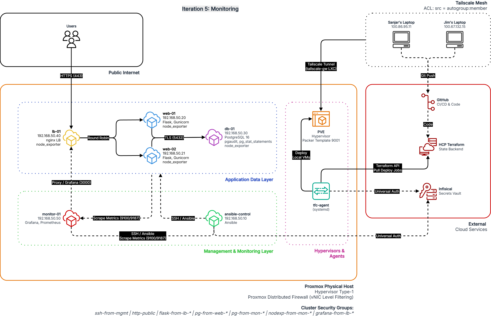
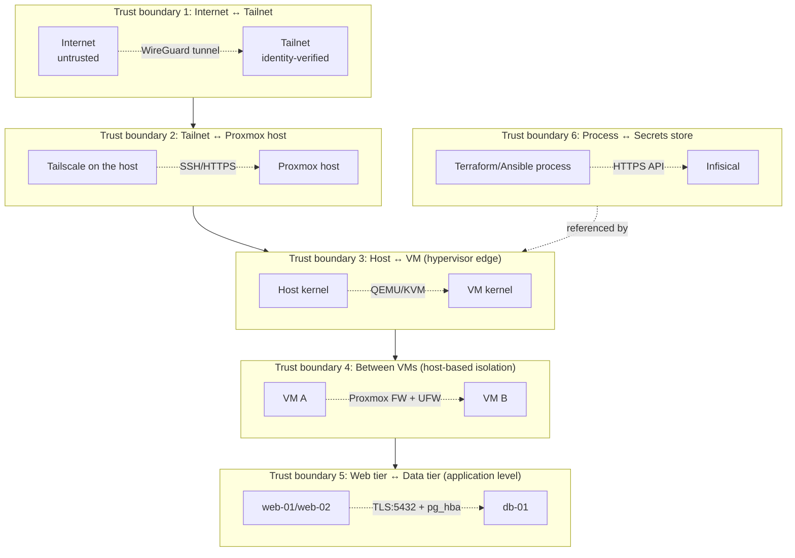

# Project plan: its25-virt-automation

**Repo:** https://github.com/sanjarbsaraee/its25-virt-automation
**Team:** Sanjar Baghchehsaraee, Jim Mickelsson
**Document version:** 1.6 (2026-05-15, iter 5 merged to main on 2026-05-14, tailscale-gw LXC took over subnet routing, workspace prefixes on cluster security groups)

---

## Contents

1. [Introduction](#1-introduction)
2. [Background](#2-background)
3. [Architecture](#3-architecture)
4. [Tool stack](#4-tool-stack)
5. [Repository structure and conventions](#5-repository-structure-and-conventions)
6. [Iteration overview](#6-iteration-overview)
7. [Verification](#7-verification)
8. [Schedule and work split](#8-schedule-and-work-split)
9. [Appendices](#9-appendices)

---

## 1. Introduction

### 1.1 What is this document?

This is the project plan for its25-virt-automation. It works as three things at the same time:

- **Tutorial reference.** You can read it cover to cover and understand the project from the ground up, even if you do not know Terraform or Ansible today.
- **Implementation guide.** When it is time to build something, you follow the iteration documents step by step.
- **Design reference.** Architecture descriptions, motivations, and design choices in this plan form the basis for later documentation and review.

### 1.2 How should the document be read?

The document has three parts:

1. **The main plan (this document)** gives the big picture: what you are building, why you are building it that way, and how the project fits together. Read in order the first time.
2. **The iteration documents** (`iteration-1.md` through `iteration-5.md`) are implementation guides. Read the one you are about to carry out, not all at once.
3. **The architecture appendix** (`arkitektur.md`) is reference material. Look things up when you need details about networking, trust boundaries, or specific resources.

Some sections are intentionally pedagogical and explain fundamentals (chapter 2). Others are reference-oriented and densely written (chapter 5). The structure adapts to what the content requires.

### 1.3 The five iterations of the project

The project is built in five iterations. Each iteration adds capacity and security on top of the previous one.

| # | Iteration | What it adds | Status |
|---|-----------|--------------------|--------|
| 1 | Foundation | 1 VM (control-node), Terraform pipeline, Ansible base structure | Done and merged to main (2026-05-04), 11/11 verified |
| 2 | Three-tier | web-01 (Flask + Gunicorn) + db-01 (PostgreSQL) | Done and merged to main (2026-05-10), 14/14 verified |
| 3 | Load balancing | lb-01 (Nginx LB) + web-02, dynamic inventory | Merged to main, 11/11 verified |
| 4 | Network hardening | UFW per VM + Proxmox firewall + SSH hardening via `devsec.hardening.ssh_hardening` | Merged to main (2026-05-12), 24/24 verified |
| 5 | Monitoring and database auditing | monitor-01 (Prometheus + Grafana + Alertmanager + postgres_exporter), node_exporter on every VM, HighCpuUsage alert rule, Grafana via lb-01, pgaudit, pg_stat_statements | Merged to main 2026-05-14, 28/28 PASS |

Mapping against the design dimensions ("scalability, robustness, redundancy, security"):

- **Iter 1-2** deliver the base but neither redundancy nor defense in depth.
- **Iter 3** gives redundancy (two web servers behind the LB) and shows scalability.
- **Iter 4** gives security hardening (defense in depth via two firewall layers + SSH hardening).
- **Iter 5** gives automated verification that the security controls are actually in place.

For the design dimensions to be fully covered, all four dimensions are needed. Iter 3 is the minimum to talk about redundancy and scalability credibly; iter 4-5 layer on security in a verifiable way.

### 1.4 What this document is not

- It is not a complete textbook on Terraform or Ansible. We explain the parts you need, with references to the official documentation at relevant places.
- It is not the final report. The final report is written separately and refers back here.
- It is not set in stone either. Reality will change during the project, IP addresses move, providers update, design choices get revisited. The document is updated continuously and changes are tracked in chapter 9.

---

## 2. Background

This chapter explains key concepts that the rest of the document builds on. If something feels obvious, skip it. If something is unclear, read carefully, it will come up again.

### 2.1 Virtualization and hypervisors

A **hypervisor** is software that lets one physical computer run several virtual machines (VMs) at the same time. Each VM has its own operating system, file system, memory, and sees itself as a physical computer.

There are two types:

- **Type 1 (bare-metal):** The hypervisor runs directly on the hardware without an underlying OS. Examples: Proxmox VE, VMware ESXi, Microsoft Hyper-V Server.
- **Type 2 (hosted):** The hypervisor runs as a program on top of a regular OS. Examples: VirtualBox, VMware Workstation.

**We use Proxmox VE 9.1**, a type 1 hypervisor. Proxmox is built on Debian Linux with KVM/QEMU for hardware virtualization and LXC for containers.

#### Why virtualization, why not containers?

A common question is why not use containers (Docker, LXC) instead. Containers are lighter and faster, but they share the kernel with the host machine, which gives weaker isolation. For this project three arguments weigh heavily against containers:

1. **The project is about virtualization.** The whole project plan is built around hypervisors and VMs.
2. **Defense in depth.** Strong isolation between tiers (web, app, db) is one of the main points of the project. Containers share the kernel; a flaw in the kernel can affect all containers at once.
3. **CIS benchmarks (iter 5).** CIS controls for Debian/Ubuntu assume a complete OS, including kernel-related controls. In containers many controls become meaningless.

Containers are not covered in this IaC project.

> **K3s, DECISION ALT A (SKIPPED), 2026-05-12.**
> K3s is skipped entirely from the project. Three options were considered: A (out of scope),
> B (iter 5), C (new iter 6 after verification). Sanjar initially leaned toward C.
> **Final decision alt A:** the design criteria (scalability, robustness, redundancy,
> security) are already covered by iter 1-5 without containers. K3s would have been a parallel
> solution to what we already have, not a complement. By the pragmatic
> design principle ("complexity only when a present problem requires it") there is no
> present problem that K3s solves. ADR 0012 documents this.

### 2.2 Infrastructure-as-Code (IaC)

**IaC** means the infrastructure (VMs, networks, firewalls) is described as code instead of being clicked together in a UI. The code is version-controlled in Git, reviewed via pull requests, and can be replayed from zero if something breaks.

Two fundamental IaC principles:

- **Declarative vs imperative.** Declarative: "I want a VM with 2 GB RAM." The tool figures out how. Imperative: "Create VM. Allocate 2 GB RAM. Start it." You say step by step. **Terraform and Ansible are both primarily declarative.**
- **Idempotency.** Running the code multiple times gives the same result. The second run changes nothing because everything is already as it should be.

#### Why both Terraform and Ansible?

Both are IaC tools, but they do different things best:

| Aspect | Terraform | Ansible |
|---|-----------|---------|
| **Provisioning** (create VMs, networks, firewalls) | ✅ Designed for this | Can do it but is clumsy |
| **Configuration inside VMs** (packages, files, users) | Clumsy | ✅ Designed for this |
| **State management** | Yes, central | No, "stateless" |
| **Agentless?** | Yes (API calls) | Yes (SSH) |

We use **Terraform to create VMs on Proxmox** and **Ansible to configure them**. This is called *separation of concerns*, each tool does what it is best at.

### 2.3 Reproducibility and idempotency, the common thread

Reproducibility and idempotency are central to the **robustness** dimension in the design dimensions. They are also central to the whole project in general.

**Reproducibility** means the same input always produces the same output. If I tear down the whole environment with `terraform destroy` and rebuild it with `terraform apply` plus `ansible-playbook site.yml`, the result must be bit-for-bit identical to what I tore down.

**Idempotency** means an operation is safe to run again. If I run `ansible-playbook site.yml` twice in a row, the second run should show "0 changed", no actual work was done, because everything was already correct.

Reproducibility is a *system requirement*. Idempotency is a *code requirement* for individual tools and tasks. If every task is idempotent and all external dependencies are pinned to specific versions, the whole system becomes reproducible.

### 2.4 Cloud-init, how VMs are configured at first boot

When a VM is created from a template, it needs initial configuration: hostname, IP address, SSH keys, what user should exist. **Cloud-init** is a standard tool that solves this.

The flow:

1. Proxmox creates a CD-ROM image with metadata (`user-data`, `meta-data`, `network-config`) and attaches it to the new VM.
2. When the VM boots, cloud-init reads the metadata from the CD and applies it.
3. The user is created, SSH keys are injected, IP addresses are configured.

We use cloud-init to inject Sanjar's and Jim's VM keys into every newly created VM, and to set the hostname and IP. Details follow in the iteration documents.

### 2.5 Three storage locations for sensitive information

The project uses an explicit model for where different types of information live:

| Storage | Contents | Examples |
|---|---|---|
| **Git** (public repo) | Code, documentation | Terraform files, Ansible roles, README |
| **Infisical** (secrets manager) | Private and public keys, API tokens | `PROXMOX_API_TOKEN`, `TERRAFORM_BOT_PRIVATE_KEY`, `SANJAR_VM_PUBLIC_KEY`, `JIM_VM_PUBLIC_KEY` |
| **Local on laptop** | Private keys for manual SSH | `~/.ssh/sanjar_vm_key`, `~/.ssh/sanjar_proxmox_key` |

Private keys exist in two places by design: in Infisical (for automation) and in `~/.ssh/` on each laptop (for manual SSH). That is intentional, if Infisical goes down, you can still SSH in.

Since 2026-05-04, public VM keys also live in Infisical (`SANJAR_VM_PUBLIC_KEY`, `JIM_VM_PUBLIC_KEY`). Terraform reads all keys at runtime via `data.infisical_secrets`. The `terraform/.ssh/` directory has been deleted, no key files live in the repo.

**Nothing labeled "secret" ends up in Git.** Not even by accident. There are three layers of protection: `.gitignore` (with a `**/.ssh/*` pattern that matches at every level), pre-commit hooks with `gitleaks`, and GitHub Push Protection.

### 2.6 Tailscale, secure remote access

The Proxmox host's web UI is on port 8006. Exposing it to the internet is not a good idea. The solution is **Tailscale**, a mesh VPN based on WireGuard.

Tailscale creates a "tailnet", a private network where each device gets a stable IP in the 100.x.y.z range. Sanjar's laptop, Jim's laptop, and the Proxmox host are all in the tailnet. When someone wants to reach the Proxmox host on 192.168.50.197, the traffic instead goes via 100.94.227.10 through Tailscale.

So laptops can also reach **VMs** directly on `192.168.50.0/24` (not just the host), a *subnet router* runs on a separate LXC container, `tailscale-gw` (`192.168.50.5`). The container advertises the LAN subnet to the tailnet and forwards traffic there. It runs on the Proxmox host but has its own identity in Tailscale and its own firewall, which isolates the subnet-routing function from the hypervisor.

> **History:** Subnet routing was on the Proxmox host itself between 2026-05-11 and 2026-05-14. That caused a conntrack bug where the host's own firewall and Tailscale's stateful filter could not sync ongoing connections, return traffic from VMs was dropped. Moved to a dedicated LXC, see `bugfix-session-2026-05-14.md`.

The result:
- No hole in the home router
- All traffic encrypted end to end
- Identity-based access (each device is uniquely identified)
- Subnet routing isolated from the hypervisor (Defense in Depth)

Tailscale is configured deeper in iter 4 with ACLs (who is allowed to talk to whom on which port).

### 2.7 GEEKOM A5, the physical base of the project

The project runs on a **GEEKOM A5 Mini PC**:

- AMD Ryzen 7 5825U (8 cores, 16 threads)
- 16 GB DDR4 RAM (upgradable to 64 GB)
- 512 GB NVMe SSD
- 2.5 GbE Ethernet (currently via WiFi bridge)
- AMD SVM enabled in BIOS, IOMMU for PCI passthrough

The machine runs Proxmox VE 9.1.7 (upgraded 2026-04-20). It is reached via Tailscale from both team members' laptops.

For iter 5, 16 GB RAM is a tight resource. Wazuh alone wants 4-8 GB. The resource planning in iter 5 shows how everything fits.

---

## 3. Architecture

This chapter describes the end goal, the architecture in place after iteration 5. Iterations 1-4 build pieces of this in turn.

### 3.1 Final architecture, overview



The diagram shows the state after iteration 5. Traffic from the public
internet enters through lb-01 (Nginx), is round-robined to web-01 or
web-02 (Flask), which talk to db-01 (PostgreSQL 16) over TLS. Every VM
exports metrics to monitor-01 (Prometheus + Grafana + Alertmanager).
Operators reach the host and all VMs through the Tailscale mesh via the
`tailscale-gw` LXC subnet router. Terraform runs through HCP Terraform's
self-hosted agent on the host; secrets are fetched from Infisical at
apply time.

### 3.2 Components, what each VM does

| VM | Role | OS | Iter | RAM | CPU | Disk |
|---|---|---|---|---|---|---|
| control-node | Ansible control node | Debian 12 | 1 | 1 GB | 2 | 8 GB |
| web-01 | Web server, Flask + Gunicorn, serves the application | Debian 12 | 2 | 1 GB | 2 | 10 GB |
| db-01 | Database, PostgreSQL 16 | Debian 12 | 2 | 2 GB | 2 | 20 GB |
| lb-01 | Load balancer, Nginx, splits traffic between web-01 and web-02 | Debian 12 | 3 | 1 GB | 2 | 8 GB |
| web-02 | Second web server, identical configuration to web-01 | Debian 12 | 3 | 1 GB | 2 | 10 GB |
| monitor-01 | Prometheus (metrics), Grafana (dashboards), node_exporter | Debian 12 | 5 | 2 GB | 2 | 20 GB |

**Total at iter 5:** ~8 GB RAM (for VMs) + ~1 GB for the Proxmox host = ~9 GB. ~76 GB disk. 7 GB RAM headroom, comfortable.

**Parked (original plan, can be brought back):** firewall-01 (nftables VM, replaced by UFW + Proxmox firewall in iter 4 v2), wazuh-01 (SIEM, replaced by pgaudit + devsec.hardening in iter 5 v2).

### 3.3 Networking

The original plan was built on VLAN segmentation (DMZ/Internal/Data/Monitoring) with a dedicated firewall-01 VM routing traffic between zones. That plan was abandoned 2026-05-10 in favor of host-based isolation via two independent firewall layers, see [arkitektur.md section 4 (Trust boundaries)](arkitektur.md#4-trust-boundaries-i-detalj).

| Subnet | What lives there |
|---|---|
| 192.168.50.0/24 (mgmt) | Proxmox host, control-node, all worker VMs (lb-01, web-01, web-02, db-01, monitor-01) |
| Tailnet 100.x.y.z | Tailscale-connected devices (laptops + Proxmox host). Subnet route to 192.168.50.0/24 from the host |

Note: all VMs sit on the same subnet. Isolation is done via the Proxmox firewall (hypervisor level) and UFW (OS level), not via a routing firewall between zones.

### 3.4 Trust boundaries

A trust boundary is the line between two areas where the trust level changes. Identifying them is central to threat modeling.



Each of these is a potential attack target. The threat model in chapter 7 goes through STRIDE per trust boundary.

### 3.5 External dependencies

The project relies on five external services. If any of them is unavailable, the project is affected in different ways:

| Service | Role | What happens if it goes down? |
|---|---|---|
| **GitHub** | Source code, CI/CD | Cannot push code or run workflows. Existing infrastructure keeps running. |
| **HCP Terraform** | State backend, run executor | Cannot run `terraform apply`. Existing VMs keep running. |
| **Infisical** | Secrets manager | New `terraform apply` fails. Existing infrastructure works (secrets are only used at provisioning time). |
| **Tailscale** | VPN, identity verification | No remote access to the Proxmox host. VMs keep running. |
| **Debian apt repos** | Package installation | New VMs cannot be configured. Existing ones work. |

All five are free tier or open source. No paid dependencies.

### 3.6 Data flows

The most important data flows in the final architecture:

**User flow (request path):**
```
Internet → router → lb-01 (Nginx) → web-01/web-02 (Flask) → db-01 (PostgreSQL)
```
Traffic is filtered at every step by two firewall layers (Proxmox firewall + UFW). No routing intermediaries.

**Development flow (deploy path):**
```
Sanjar/Jim laptop → terraform CLI → HCP Terraform → self-hosted agent on Proxmox host → Proxmox API → new/updated VM
                                                          ↓
                                                  Infisical (fetch secrets)
```

**Configuration flow (Ansible path):**

In iter 1 (push mode):
```
Team member laptop → SSH to control-node → Ansible playbook → configuration applied
```

In iter 3 and onward (pull mode):
```
Each VM → ansible-pull cron → fetch repo from GitHub → apply playbook locally
```

**Monitoring flow:**
```
Each VM → node_exporter, application exporters → monitor-01 (Prometheus)
                                                          ↓
                                                   Grafana dashboards
```

**Security flow (audit path):**
```
PostgreSQL queries → pgaudit extension → /var/log/postgresql/
```
Manual review during the presentation. Wazuh manager (original plan) parked, see decision log.

### 3.7 What the architecture does *not* contain

To be clear about what is out of scope:

- **High availability at the host level.** There is one host. If it dies, everything is down. For a lab that is acceptable.
- **Off-site backup.** Backups go to an external USB SSD that lives in the same physical location. For a lab that is acceptable.
- **Real CA infrastructure.** TLS certificates are self-signed or from an internal step-ca. Not Let's Encrypt or a commercial CA.
- **Real user management.** No real user accounts, no real sessions. The web application that runs is a demo.
- **Kubernetes, Docker Swarm, container orchestration.** VMs all the way. K3s skipped (alt A, decided 2026-05-12), see ADR 0012.

> **K3s, DECISION ALT A (SKIPPED), 2026-05-12.**
> K3s is skipped entirely. The design criteria are covered by iter 1-5 without containers.
> See the K3s note at section 2.1 above for the full rationale.

These boundaries are documented clearly in the final report so the reader knows what was intentionally left out.

---
## 4. Tool stack

This chapter walks through every tool we use, what it does, and why exactly that one was picked. For every tool, alternatives considered and rejected are also listed.

### 4.1 Proxmox VE 9.1

**What it is:** A type 1 hypervisor built on Debian Linux, KVM/QEMU, and LXC. Manages VMs and containers via a web UI and a REST API.

**Version:** Proxmox VE 9.1.7, upgraded 2026-04-20. Kernel version 6.17.13-2-pve.

**Why Proxmox?**

Many introductory labs for virtualization use VirtualBox, a type 2 hypervisor. VirtualBox is fine for individual laptop use but has two weaknesses for this project:

1. No public API that Terraform can target reliably
2. No natural way for two people to work against the same VMs at the same time

Proxmox runs directly on the hardware and has a REST API that Terraform reaches via the `bpg/proxmox` provider. This enables real IaC and teamwork, which the design dimensions assume by requiring scalability, robustness, and redundancy.

**Concrete hardware:** GEEKOM A5 Mini PC (AMD Ryzen 7 5825U, 16 GB RAM, 512 GB NVMe SSD, 2.5 GbE). AMD SVM enabled in BIOS for hardware virtualization.

**Storage:** Currently LVM-thin (default configuration). ZFS libraries are installed but not actively used, a leftover from the Proxmox default packages that get upgraded by `apt full-upgrade`.

### 4.2 Terraform with the bpg/proxmox provider

**What it is:** Terraform is a declarative IaC tool that describes infrastructure as code. `bpg/proxmox` is a third-party provider that lets Terraform create, change, and remove resources on Proxmox via its API.

**Versions:**

- Terraform CLI: pinned to the `~> 1.9` series
- `bpg/proxmox` provider: 0.103.0 (upgraded from 0.68.0 on 2026-04-26)
- `infisical/infisical` provider: ~> 0.16 (added 2026-04-26 for runtime secret reading)

**Why `bpg/proxmox` and not `Telmate/proxmox`?**

Both providers are actively developed. The difference is breadth. `Telmate/proxmox` focuses on VMs, LXC, pools, and cloud-init disks. `bpg/proxmox` covers the whole Proxmox environment: VMs, LXC, cluster, hosts, security groups, ACLs, network configuration, SDN, users, and more. For this project we need VLAN-aware bridges (iter 4), ACLs, and SDN features, things bpg supports directly while Telmate does not.

`bpg/proxmox` also has a faster release cycle, more releases per year and faster bug fixes according to active users on the Proxmox community forum.

Going from provider version 0.68.0 to 0.103.0 is safe: the only breaking changes between those versions are about LXC containers (we use VMs) and attributes we do not use (`template = true` on the VM resource, not to be confused with the `clone` block).

**License note:** Since August 2023, Terraform is under BUSL (Business Source License). OpenTofu is a drop-in MPL 2.0 fork that can be used instead if the license becomes a problem. For this project we chose Terraform.

**Why Terraform instead of just Ansible?**

Ansible alone can both provision and configure VMs via its Proxmox modules. The choice to split provisioning to Terraform and configuration to Ansible is deliberate:

- Terraform is declarative and designed around infrastructure state. It knows what exists, what should exist, and can compute the difference.
- Ansible is imperative and oriented around tasks applied to hosts.

Asking Ansible to own both provisioning state and configuration state blurs the line and makes drift harder to detect. The split gives *separation of concerns*, each tool does what it is best at.

**Code structure (since 2026-04-26):**

The Terraform code is split into six files in the `terraform/` directory according to HashiCorp Standard Module Structure:

- `terraform.tf`, engine version, provider requirements, HCP backend
- `providers.tf`, runtime configuration for providers
- `variables.tf`, input variables
- `data.tf`, data sources (Infisical secrets, file reads) and locals
- `main.tf`, only the resources
- `outputs.tf`, output values

The structure makes the code easier to navigate as it grows in iter 2-5, allows parallel work without git conflicts, and is industry standard, which strengthens the report.

### 4.3 Ansible with community.proxmox

**What it is:** Ansible is a configuration management tool that runs over SSH (or WinRM on Windows). `community.proxmox` is the collection of Ansible modules that specifically target Proxmox.

**Versions:**

- Ansible Core: pinned to the `~> 2.17` series
- `community.proxmox` collection: 1.6.0

**Why `community.proxmox` and not `community.general`?**

The Proxmox modules were extracted from `community.general` into their own collection `community.proxmox` in May 2025. Redirects in `community.general` will be removed in version 15.0.0. Using the new collection is future-proof and gets faster updates.

**How Ansible is run in the project:**

In iteration 1, Ansible runs from a team member's laptop (push mode, Ansible on the laptop SSHes into the VM and applies the configuration). From iteration 3 onward the plan is to move to **pull mode** with `ansible-pull` on the control-node and on each configured VM.

The difference:

- **Push mode (iter 1):** The Ansible process runs on the laptop, SSHes out to every VM, applies tasks. The VM is a passive recipient.
- **Pull mode (iter 3+):** Every VM runs a cron job with `ansible-pull` that fetches the Ansible code directly from the Git repo and applies it locally. No central process needs SSH access to every VM.

Pull mode is safer in a multi-zone architecture because no central account needs SSH rights to all zones. Each VM fetches only its own configuration from Git. Push mode is simpler for a first iteration when there is only one VM.

### 4.4 HCP Terraform (state backend and run executor)

**What it is:** HashiCorp Cloud Platform Terraform, formerly "Terraform Cloud". A SaaS service that stores Terraform state, runs `terraform plan` and `apply`, and keeps version history for rollback.

**Tier:** Enhanced Free Tier (the legacy Free tier expired 2026-03-31). Limits:

- 500 managed resources (we never reach this with 5-8 VMs)
- 1 concurrent run
- Unlimited users
- VCS integration available (can be connected to the GitHub repo if desired)
- Private module registry
- 1 self-hosted agent
- Sentinel and OPA policies (limited count)

**Workspaces (updated 2026-04-29):** Three HCP Terraform workspaces tagged `its25` in the organization `its25-virt-automation`:

- `its25-virt-automation`, main workspace, for verified work merged from feature branches
- `its25-sanjar-dev`, Sanjar's test workspace
- `its25-jim-dev`, Jim's test workspace

Tag-based binding eliminates VM collisions during parallel branch work without duplicating code. Sensitive variables (`INFISICAL_*` × 3) are copied to all three workspaces.

The `env_config` table in `terraform/main.tf` maps workspace to VM-ID base and IP base. Default fallback to main config if an unknown workspace is used. Details in `arkitektur.md` section 3.4.

**Execution mode:** Agent (custom) → the pool `proxmox-homelab`. The default mode Remote (HCP cloud runner) does not work for this project because HCP's cloud runners cannot reach the Tailscale network where the Proxmox host lives. A self-hosted agent on the Proxmox host solves this, the agent has local network access and can therefore reach the Proxmox API. The endpoint in `variables.tf` now points to the host's LAN IP (`192.168.50.197:8006`), formerly the Tailscale IP (`100.94.227.10:8006`), the change happened 2026-05-14 when Tailscale routing was moved to the `tailscale-gw` LXC.

**State backend configuration (tag-based):**

```hcl
terraform {
  cloud {
    organization = "its25-virt-automation"
    workspaces {
      tags = ["its25"]
    }
  }
}
```

**HCP self-hosted agent:** Runs on the Proxmox host as a systemd service under the `tfc-agent` user (UID 999, no sudo, no shell). Required because HCP cloud runners cannot reach the Tailscale network. Full details (pool ID, binary paths, systemd hardening directives, token rotation) in `project-knowledge-base.md` section 6.8.

**Workflow history:** Three HCP models were tested (CLI-driven, VCS-driven, CLI + agent) before the current one was chosen. Documented in `project-knowledge-base.md` section 6.9.

**Why HCP Terraform and not local state or S3?**

- Local state (a `terraform.tfstate` file in the directory) works for one person but not for a team. Different people cannot sync easily without overwriting each other's changes.
- S3 backend requires an AWS account and costs money.
- HCP Terraform is free, handles locking automatically (two people cannot run `apply` at the same time), and has version history.

### 4.5 Infisical (secrets management)

**What it is:** Open source secrets manager. Can be run self-hosted or as SaaS. We use the SaaS version (free tier).

**Organization structure:**

- Organization: `its25-virt-automation`
- Project: `proxmox-automation` (note: the name comes from an older design and is kept)
- Environment: Development
- Machine identity: `terraform-its25` (Universal Auth, Member role in the organization and project)

**Stored secrets (as of 2026-04-26):**

| Secret | Contents | Used by |
|---|---|---|
| `PROXMOX_API_TOKEN` | Token for the `terraform@pve` user | Terraform provider |
| `SANJAR_VM_PRIVATE_KEY` | Sanjar's private SSH key for VMs | Terraform/Ansible as needed |
| `JIM_VM_PRIVATE_KEY` | Jim's private SSH key for VMs | Terraform/Ansible as needed |
| `SANJAR_PROXMOX_PRIVATE_KEY` | Sanjar's private SSH key for the Proxmox host | Manual SSH |
| `JIM_PROXMOX_PRIVATE_KEY` | Jim's private SSH key for the Proxmox host | Manual SSH |
| `TERRAFORM_BOT_PRIVATE_KEY` | The terraform-bot user's private host key | Terraform provider (host SSH) |

Multi-line encoding is enabled on all key secrets so they work correctly across multiple lines.

**Universal Auth:** Machine identity authenticates to Infisical with a Client ID plus Client Secret pair. Plus an Identity ID. All three values are stored as sensitive workspace environment variables in HCP Terraform under the names `INFISICAL_UNIVERSAL_AUTH_CLIENT_ID`, `INFISICAL_UNIVERSAL_AUTH_CLIENT_SECRET`, and `INFISICAL_MACHINE_IDENTITY_ID`. Terraform reads them automatically at runtime.

**Why Universal Auth and not OIDC?**

OIDC is safer long term, no long-lived Client Secrets, but requires more initial setup. Universal Auth is enough for a school project with a low risk profile. Migration to OIDC sits on the backlog.

**Why Infisical and not HashiCorp Vault?**

Vault is the industry standard but requires more operational responsibility (HA setup, unsealing, lease management). Infisical SaaS is free, has a native Terraform provider, and fits a two-person project better.

### 4.6 Tailscale (mesh VPN)

**What it is:** A mesh VPN based on WireGuard. Every device in the tailnet gets a stable 100.x IP. All traffic between devices is encrypted end to end.

**Tailnet name:** `sanjarbsaraee.github`. Sanjar is the owner. Approval required is enabled.

**Devices:**

| Device | Tailscale IP | Role |
|---|---|---|
| `pve` (Proxmox host) | 100.94.227.10 | Host machine |
| `sanjarb` (Sanjar's laptop) | 100.86.95.11 | Team member |
| `lighthouse` (Jim's laptop, Windows 11 25H2) | 100.67.132.15 | Team member |

Tailscale version on the Proxmox host: 1.96.4.

**Why Tailscale?**

Two alternatives were considered:

1. **Port forward 8006 to the internet.** Simple but exposes the Proxmox host's web UI to the whole world. Bad choice.
2. **Regular VPN (OpenVPN, WireGuard manually).** Works but requires more setup and a coordination server.

Tailscale gives:
- Identity-based access (every device is uniquely identified via OAuth)
- No hole in the home router
- ACLs for fine-grained access control (used from iter 4)
- MagicDNS for device names

### 4.7 GitHub (source control and CI/CD)

**What it is:** Git hosting with built-in CI/CD via GitHub Actions, issue tracking, and pull request flows.

**Repo:** `https://github.com/sanjarbsaraee/its25-virt-automation`. Public, branch `main`. Topics: `ansible`, `devops`, `terraform`, `virtualization`, `infrastructure-as-code`, `proxmox`, `homelab`, `network-segmentation`.

**Branch strategy:** GitHub Flow.

- `main` is always deployable
- Feature branches are named with a prefix (`feat/`, `fix/`, `docs/`, `chore/`)
- A pull request is required to merge
- Squash on merge so `main` gets a linear history
- Branches are deleted after merge

Work is currently ongoing on the `feature/infisical-integration` branch. It is pushed to GitHub with seven commits ahead of `main`.

**Conventional Commits:** Uses `feat`, `fix`, `chore`, `docs`, `refactor`, `test`, `build`, `ci`. Scopes: `terraform`, `ansible`, `docs`, `ci`, `iter-1` through `iter-5`.

### 4.8 Summary table

| Tool | Version | Role |
|---|---|---|
| Proxmox VE | 9.1.7 | Hypervisor (type 1) |
| Terraform CLI | ~> 1.9 | Provisioning |
| `bpg/proxmox` provider | 0.103.0 | Terraform to Proxmox API |
| `infisical/infisical` provider | ~> 0.16 | Terraform to Infisical |
| Ansible Core | 2.19 via pipx (template 9001 baseline 2.14 is replaced at bootstrap) | Configuration |
| `community.proxmox` collection | 1.3.0 (dynamic inventory plugin) | Ansible to Proxmox |
| `community.postgresql` collection | 4.2.0 | PostgreSQL tasks |
| `infisical.vault` collection | 1.1.4 | Infisical lookup for secrets |
| `community.general` collection | (ships with ansible-core 2.19) | UFW and various |
| `devsec.hardening` collection | 10.5.0 (planned iter 4-5) | SSH and OS hardening |
| HCP Terraform | Enhanced Free tier | State plus run executor |
| HCP Terraform agent | 1.28.7 | Self-hosted run executor on the Proxmox host |
| Infisical | SaaS | Secrets manager |
| Tailscale | 1.96.4 | VPN, remote access, subnet routing 192.168.50.0/24 |
| GitHub | --- | Source code, CI/CD |
| Debian (guest OS) | 12 (bookworm) | OS in all VMs |
| PostgreSQL | 16 | Database in db-01 (iter 2 onward) |

---
## 5. Repository structure and conventions

This chapter is reference-oriented. Look it up when you need to know what something should be named, where it lives, or how a commit message is formed.

### 5.1 Directory layout

The repo's planned final structure:

```
its25-virt-automation/
├── .github/
│   ├── workflows/                  # GitHub Actions
│   ├── ISSUE_TEMPLATE/
│   ├── pull_request_template.md
│   └── dependabot.yml
├── docs/
│   ├── architecture/               # Architecture documents
│   ├── decisions/                  # ADRs (MADR format)
│   ├── iterations/                 # Iter 1-5 documentation
│   ├── runbooks/                   # How-we-fix-X guides
│   ├── security/                   # Threat model, hardening
│   ├── setup/                      # How-things-were-set-up guides
│   └── reference/                  # Technical references
├── terraform/
│   ├── terraform.tf                # Engine version plus cloud {} backend
│   ├── providers.tf                # Provider configuration
│   ├── variables.tf
│   ├── data.tf                     # Infisical secrets and locals
│   ├── main.tf                     # Resources
│   ├── outputs.tf
│   ├── ansible-bootstrap.yaml      # Cloud-init snippet template
│   ├── terraform.tfvars.example    # Template, committed
│   ├── .terraform.lock.hcl         # COMMITTED
│   └── modules/
│       └── vm/                     # Own local VM module
├── ansible/
│   ├── ansible.cfg
│   ├── inventories/
│   │   └── prod/
│   │       ├── proxmox.proxmox.yml # Dynamic inventory
│   │       ├── group_vars/
│   │       └── host_vars/
│   ├── playbooks/
│   │   ├── site.yml                # Top-level playbook
│   │   ├── proxmox-bootstrap.yml
│   │   └── harden.yml
│   ├── roles/
│   │   ├── common/
│   │   ├── control_node_check/
│   │   ├── flask_app/
│   │   ├── postgres_server/
│   │   ├── nginx_lb/
│   │   ├── node_exporter/             # iter 5
│   │   └── prometheus_server/         # iter 5
│   └── collections/
│       └── requirements.yml
├── packer/
│   ├── debian-12-gold.pkr.hcl
│   └── http/
│       └── preseed.cfg
├── scripts/
│   ├── verify-iter1.sh
│   ├── verify-iter2.sh
│   ├── verify-iter3.sh
│   ├── verify-iter4.sh
│   ├── verify-iter5.sh
│   └── verify-node.sh
├── .gitignore
├── .pre-commit-config.yaml
├── README.md
└── LICENSE
```

### 5.2 File naming rules

- Lowercase, hyphen-separated (`web-01.yml`, not `Web_01.YML`)
- ISO 8601 dates in filenames when relevant (`bugfix-session-2026-05-14.md`)
- ADRs are numbered four digits: `0001-foo.md`, `0002-bar.md`
- Iteration documents follow the pattern `iteration-N.md`

### 5.3 Language rules

Project documentation is written in **English with American spelling**. This document (the project plan) is an exception and is written in Swedish because it works as a tutorial reference for the team.

**Spelling:** `catalog`, `license`, `organize`, `behavior`, `analyze` (American). Not `catalogue`, `licence`, `organise`, `behaviour`, `analyse` (British).

**AI-tells to avoid in all written documentation:**

`delve`, `leverage`, `utilize`, `facilitate`, `streamline`, `robust`, `seamless`, `pivotal`, `tapestry`, `realm`, `underscore`, `furthermore`, `moreover`, `comprehensive`, `dive into`, `it is worth noting`, `navigate the landscape`, `unleash`, `harness`.

**Compound adjectives before nouns get hyphens:**

`end-to-end`, `three-tier`, `peer-to-peer`, `self-hosted`, `third-party`, `user-facing`, `bare-metal`, `how-to`, `trade-off`, `state-of-the-art`, `least-privilege`, `defense-in-depth`.

**Active voice, varied sentence length, commas (not em-dashes).**

**ISO 8601 dates:** `2026-04-26`, not `26 April 2026` or `4/26/2026`.

### 5.4 Conventional Commits

The project follows the [Conventional Commits](https://www.conventionalcommits.org/) standard. Every commit message has the form:

```
<type>(<scope>): <short description>

<longer body, optional>

<footer, optional>
```

**Types we use:**

| Type | When |
|---|---|
| `feat` | New functionality |
| `fix` | Bug fix |
| `docs` | Only documentation changes |
| `chore` | Maintenance (dependency updates, formatting) |
| `refactor` | Code change without new functionality |
| `test` | Add or change tests |
| `build` | Build system or dependency changes |
| `ci` | CI/CD changes |

**Scopes we use:** `terraform`, `ansible`, `packer`, `docs`, `ci`, `iter-1` through `iter-5`.

**Examples:**

```
feat(terraform): add web-01 VM resource

Implements the first worker VM for iter 2.
Uses the bpg/proxmox provider with a clone block from template 9001.
```

```
fix(ansible): resolve Infisical lookup .value vs |first

The infisical.vault lookup returns a single object, not a list.
Using .value instead of |first.
```

```
docs(arch): document the workspace prefix on cluster security groups

Resolves the "last apply wins" issue from 2026-05-14.
```

### 5.5 .gitignore

The repo's `.gitignore` is strict. Anything that could leak secrets is blocked at multiple levels:

```
# Terraform
*.tfstate
*.tfstate.*
.terraform/
.terraform.lock.hcl
*.tfvars
!terraform.tfvars.example

# Secrets, private keys
**/.ssh/*
*.pem
*.key
*.crt
*_rsa
*_ed25519
*_ecdsa
secrets/
.env

# Ansible
*.retry
.ansible-vault-password

# Packer
packer_cache/
*.box

# OS and editor
.DS_Store
Thumbs.db
.vscode/
.idea/
*.swp
*~

# Build artifacts
build/
dist/
__pycache__/
*.pyc
```

The `**/.ssh/*` pattern matches at every level so even `terraform/.ssh/some-key` is blocked.

### 5.6 Pre-commit hooks

Pre-commit hooks run automatically on `git commit` and stop commits that contain secrets or broken syntax. The `.pre-commit-config.yaml` file defines them:

```yaml
repos:
  - repo: https://github.com/gitleaks/gitleaks
    rev: v8.18.0
    hooks:
      - id: gitleaks

  - repo: https://github.com/antonbabenko/pre-commit-terraform
    rev: v1.83.5
    hooks:
      - id: terraform_fmt
      - id: terraform_validate

  - repo: https://github.com/ansible-community/ansible-lint
    rev: v6.22.1
    hooks:
      - id: ansible-lint

  - repo: https://github.com/pre-commit/pre-commit-hooks
    rev: v4.5.0
    hooks:
      - id: trailing-whitespace
      - id: end-of-file-fixer
      - id: check-merge-conflict
      - id: detect-private-key
```

Installed locally with `pre-commit install` after cloning.

### 5.7 Diátaxis, the documentation framework

The project follows the [Diátaxis](https://diataxis.fr/) framework for documentation. Four types of documents, four different purposes:

| Type | Purpose | Example in this repo |
|---|---|---|
| **Tutorial** | Learning by doing | The "Getting started" section of the README |
| **How-to guide** | Solving a specific problem | `docs/runbooks/restore-from-backup.md` |
| **Reference** | Looking things up | This document, `arkitektur.md` |
| **Explanation** | Understanding why | ADRs, the "Decision log" in iteration documents |

The point is that the reader knows what type they are reading. A tutorial assumes nothing. A reference assumes you know what you are looking for. Mixing types makes both worse.

### 5.8 ADR (Architecture Decision Records)

Major decisions are recorded as ADRs in MADR format. Each ADR is a Markdown file with a fixed structure:

```markdown
# ADR 0001: <title>

## Status
Accepted | Superseded by ADR-0002

## Context
What was the problem?

## Decision
What did we decide?

## Consequences
What does this lead to?
```

ADRs are immutable once accepted. If a decision is revisited, a new ADR is written with a `Superseded by` reference.

The ADRs we have written or plan to write:

| Number | Title | Status |
|---|---|---|
| 0001 | Choice of Terraform plus Ansible over Ansible alone | Accepted |
| 0002 | Choice of `bpg/proxmox` over `Telmate/proxmox` | Accepted |
| 0003 | Choice of HCP Terraform free tier as state backend | Accepted |
| 0004 | Choice of Infisical over HashiCorp Vault | Accepted |
| 0005 | Choice of Universal Auth over OIDC | Accepted |
| 0006 | Choice of Tailscale over port forwarding or WireGuard manually | Accepted |
| 0007 | Choice of UFW + Proxmox firewall over nftables + VLAN | Accepted (2026-05-10) |
| 0008 | Choice of pgaudit + devsec.hardening over Wazuh | Accepted (2026-05-10) |
| 0009 | Choice of dedicated tailscale-gw LXC over host-level subnet routing | Accepted (2026-05-14) |
| 0010 | Workspace prefixes on cluster security groups | Accepted (2026-05-14) |
| 0011 | Prometheus from Debian apt over the official Ansible collection | Accepted (2026-05-12) |
| 0012 | K3s skipped from the project (alt A) | Accepted (2026-05-12) |

### 5.9 Summary of conventions

| Convention | Where |
|---|---|
| File naming | Section 5.2 |
| Language and spelling | Section 5.3 |
| Conventional Commits | Section 5.4 |
| .gitignore patterns | Section 5.5 |
| Pre-commit hooks | Section 5.6 |
| Diátaxis | Section 5.7 |
| ADRs in MADR format | Section 5.8 |

---
