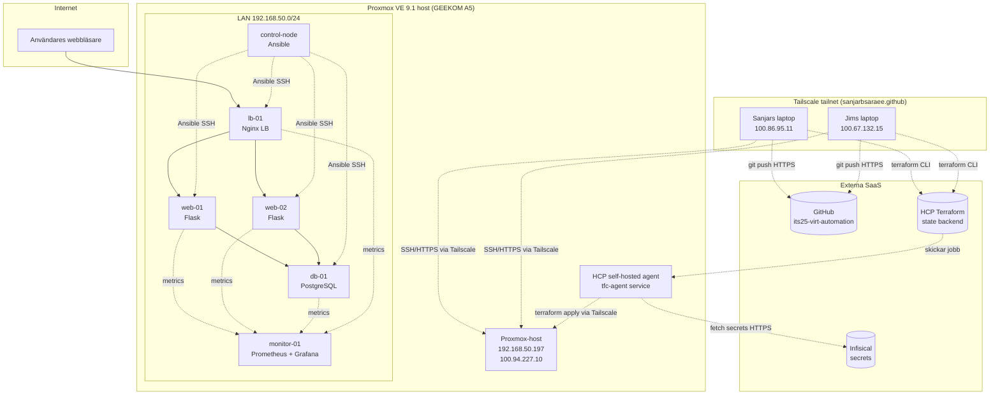
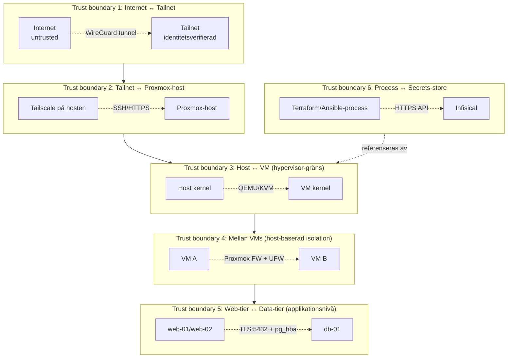

# Project plan: its25-virt-automation

**Repo:** https://github.com/sanjarbsaraee/its25-virt-automation
**Team:** Sanjar Baghchehsaraee, Jim Mickelsson
**Dokumentversion:** 1.6 (2026-05-15 — iter 5 mergad till main 2026-05-14, tailscale-gw LXC tog över subnet routing, workspace-prefix på cluster security groups)

---

## Innehåll

1. [Inledning](#1-inledning)
2. [Bakgrund och förkunskaper](#2-bakgrund-och-förkunskaper)
3. [Arkitektur](#3-arkitektur)
4. [Verktygsstacken](#4-verktygsstacken)
5. [Repostruktur och konventioner](#5-repostruktur-och-konventioner)
6. [Iterationsöversikt](#6-iterationsöversikt)
7. [Verifiering](#7-verifiering)
8. [Tidsplan och arbetsfördelning](#8-tidsplan-och-arbetsfördelning)
9. [Bilagor](#9-bilagor)

---

## 1. Inledning

### 1.1 Vad är detta för dokument?

Detta är projektplanen för its25-virt-automation. Den fungerar som tre saker samtidigt:

- **Lärobok.** Du kan läsa pärm-till-pärm och förstå projektet från grunden, även om du inte kan Terraform eller Ansible idag.
- **Genomförandeguide.** När det är dags att bygga något följer du iterationsdokumenten steg för steg.
- **Designreferens.** Arkitekturbeskrivningar, motiveringar och designval i denna plan utgör underlag för senare dokumentation och granskning.

### 1.2 Hur ska dokumentet läsas?

Dokumentet består av tre delar:

1. **Huvudplanen (det här dokumentet)** ger den stora bilden: vad ni bygger, varför ni bygger det så, och hur projektet hänger ihop. Läs i ordning första gången.
2. **Iterationsdokumenten** (`iteration-1.md` till `iteration-5.md`) är genomförandeguider. Läs den ni ska genomföra härnäst, inte alla på en gång.
3. **Arkitektur-bilagan** (`arkitektur.md`) är referensmaterial. Slå upp när ni behöver detaljer om nätverk, trust boundaries eller specifika resurser.

Vissa avsnitt är medvetet pedagogiska och förklarar grundbegrepp (kapitel 2). Andra är referensorienterade och tätt skrivna (kapitel 5). Strukturen anpassar sig efter vad innehållet kräver.

### 1.5 Projektets fem iterationer

Projektet byggs i fem iterationer. Varje iteration adderar kapacitet och säkerhet på den föregående.

| # | Iteration | Vad som tillkommer | Status |
|---|-----------|--------------------|--------|
| 1 | Foundation | 1 VM (control-node), Terraform-pipeline, Ansible-grundstruktur | Klar och mergad till main (2026-05-04), 11/11 verifierad |
| 2 | Three-tier | web-01 (Flask + Gunicorn) + db-01 (PostgreSQL) | Klar och mergad till main (2026-05-10), 14/14 verifierad |
| 3 | Load balancing | lb-01 (Nginx LB) + web-02, dynamic inventory | Mergad till main, 11/11 verifierad |
| 4 | Network hardening | UFW per VM + Proxmox firewall + SSH-härdning via `devsec.hardening.ssh_hardening` | Planerad (plan reviderad 2026-05-10, ursprunglig nftables+VLAN-plan parkerad) |
| 5 | Monitoring och databas-auditing | monitor-01 (Prometheus + Grafana + Alertmanager + postgres_exporter), node_exporter på alla VMs, HighCpuUsage alert rule, Grafana via lb-01, pgaudit, pg_stat_statements | Mergad till main 2026-05-14, 28/28 PASS |

Mappning mot designdimensionerna i projektplanen ("skalbarhet, robusthet, redundans, säkerhet"):

- **Iter 1-2** levererar grunden men varken redundans eller defense-in-depth.
- **Iter 3** ger redundans (två web-servrar bakom LB) och visar skalbarhet.
- **Iter 4** ger säkerhetshärdning (defense in depth via två firewall-lager + SSH-härdning).
- **Iter 5** ger automated verification av att säkerheten finns på plats.

För att designdimensionerna ska vara fullt täckt krävs alla fyra dimensioner. Iter 3 är minimum för att kunna prata om redundans och skalbarhet på ett trovärdigt sätt; iter 4-5 lägger på säkerhet på ett verifierbart sätt.

### 1.5 Vad detta dokument inte är

- Det är inte en komplett lärobok i Terraform eller Ansible. Vi förklarar de delar ni behöver, men referenser till de officiella dokumentationerna ges på relevanta ställen.
- Det är inte slutrapporten. Slutrapporten skrivs separat och refererar tillbaka hit.
- Det är inte heller huggit i sten. Verkligheten kommer ändra sig under projektets gång — IP-adresser flyttar, providers uppdateras, designval omprövas. Dokumentet uppdateras kontinuerligt och ändringar dokumenteras i kapitel 9.

---

## 2. Bakgrund och förkunskaper

Det här kapitlet förklarar nyckelbegrepp som resten av dokumentet bygger på. Om något känns självklart, hoppa över det. Om något är oklart, läs noga — det kommer dyka upp igen.

### 2.1 Virtualisering och hypervisorer

En **hypervisor** är programvara som låter en fysisk dator köra flera virtuella datorer (VMs) samtidigt. Varje VM har ett eget operativsystem, eget filsystem, eget minne, och uppfattar sig själv som en fysisk dator.

Det finns två typer:

- **Typ 1 (bare-metal):** Hypervisorn körs direkt på hårdvaran utan ett underliggande OS. Exempel: Proxmox VE, VMware ESXi, Microsoft Hyper-V Server.
- **Typ 2 (hosted):** Hypervisorn körs som ett program ovanpå ett vanligt OS. Exempel: VirtualBox, VMware Workstation.

**Vi använder Proxmox VE 9.1**, vilket är en typ 1-hypervisor. Proxmox bygger på Debian Linux med KVM/QEMU för hårdvaruvirtualiseringen och LXC för containers.

#### Varför virtualisering, varför inte containers?

En vanlig fråga är varför man inte använder containers (Docker, LXC) istället. Containers är lättare och snabbare, men de delar kärna med värddatorn vilket ger svagare isolation. För det här projektet väger tre argument tungt mot containers:

1. **Projektet handlar om virtualisering.** Hela projektplanen utgår från hypervisorer och VMs.
2. **Defense in depth.** Stark isolation mellan tiers (web, app, db) är en av huvudpoängerna med projektet. Containers delar kärna; ett fel i kärnan kan påverka alla containers samtidigt.
3. **CIS-benchmarks (iter 5).** CIS-kontroller för Debian/Ubuntu antar ett komplett OS, inklusive kärn-relaterade kontroller. I containers blir flera kontroller meningslösa.

Containers behandlas inte i det här IaC-projektet.

> **K3s — BESLUT ALT A (SKIPPAD), 2026-05-12.**
> K3s skippas helt från projektet. Tre alternativ övervägdes: A (utanför),
> B (iter 5), C (ny iter 6 efter verifikationen). Sanjar lutade ursprungligen mot C.
> **Slutligt beslut alt A:** designkriterierna (skalbarhet, robusthet, redundans,
> säkerhet) täcks redan av iter 1-5 utan containers. K3s hade varit en parallell
> lösning till det vi redan har, inte ett komplement. Per pragmatisk
> designprincip ("komplexitet bara när nu-problem kräver det") finns inget
> nu-problem som K3s löser. ADR 0012 dokumenterar detta.

### 2.2 Infrastructure-as-Code (IaC)

**IaC** betyder att infrastrukturen — VMs, nätverk, brandväggar — beskrivs som kod istället för att klickas fram i ett gränssnitt. Koden versionshanteras i Git, granskas via pull requests, och kan köras om från noll om något går sönder.

Två fundamentala IaC-principer:

- **Deklarativt vs imperativt.** Deklarativt: "Jag vill ha en VM med 2 GB RAM." Verktyget räknar ut hur. Imperativt: "Skapa VM. Tilldela 2 GB RAM. Starta den." Du säger steg för steg. **Terraform och Ansible är båda primärt deklarativa.**
- **Idempotens.** Att köra koden flera gånger ger samma resultat. Den andra körningen ändrar ingenting eftersom allt redan är som det ska.

#### Varför både Terraform och Ansible?

Båda är IaC-verktyg, men de gör olika saker bäst:

| Aspekt | Terraform | Ansible |
|---|-----------|---------|
| **Provisionering** (skapa VMs, nätverk, brandväggar) | ✅ Designat för detta | Kan men är klumpigt |
| **Konfiguration inuti VMs** (paket, filer, användare) | Klumpigt | ✅ Designat för detta |
| **State-hantering** | Ja, central | Nej, "stateless" |
| **Agentless?** | Ja (API-anrop) | Ja (SSH) |

Vi använder **Terraform för att skapa VMs på Proxmox** och **Ansible för att konfigurera dem**. Detta kallas *separation of concerns* — varje verktyg gör det det är bäst på.

### 2.3 Reproducerbarhet och idempotens — den röda tråden

Reproducerbarhet och idempotens är centrala för **robusthet**-dimensionen i designdimensionerna. De är också centrala i hela projektet generellt.

**Reproducerbarhet** betyder att samma input alltid producerar samma output. Om jag river hela miljön med `terraform destroy` och bygger upp den igen med `terraform apply` plus `ansible-playbook site.yml`, ska resultatet vara bit-för-bit identiskt med det jag rev.

**Idempotens** betyder att operationen är säker att köra om. Om jag kör `ansible-playbook site.yml` två gånger i rad, ska den andra körningen visa "0 changed" — inget faktiskt arbete gjordes, för allt var redan rätt.

Reproducerbarhet är ett *systemkrav*. Idempotens är ett *kodkrav* för enskilda verktyg och tasks. Om varje task är idempotent och alla externa beroenden är pinnade till specifika versioner, blir hela systemet reproducerbart.

### 2.4 Cloud-init — hur VMs konfigureras vid första boot

När en VM skapas från en mall (template) behöver den initialkonfiguration: hostname, IP-adress, SSH-nycklar, vilken användare som ska finnas. **Cloud-init** är ett standardverktyg som löser detta.

Flödet:

1. Proxmox skapar en CD-ROM-image med metadata (`user-data`, `meta-data`, `network-config`) och ansluter den till den nya VM:en.
2. När VM:en startar läser cloud-init metadatan från CD:n och tillämpar den.
3. Användare skapas, SSH-nycklar läggs in, IP-adresser konfigureras.

Vi använder cloud-init för att injicera Sanjars och Jims VM-nycklar i varje skapad VM, och för att sätta hostname och IP. Detaljer kommer i iterationsdokumenten.

### 2.5 Tre lagringsplatser för känslig information

Projektet använder en explicit modell för var olika typer av information lagras:

| Lagringsplats | Innehåll | Exempel |
|---|---|---|
| **Git** (publikt repo) | Kod, dokumentation | Terraform-filer, Ansible-roller, README |
| **Infisical** (secrets manager) | Privata och publika nycklar, API-tokens | `PROXMOX_API_TOKEN`, `TERRAFORM_BOT_PRIVATE_KEY`, `SANJAR_VM_PUBLIC_KEY`, `JIM_VM_PUBLIC_KEY` |
| **Lokalt på laptop** | Privata nycklar för manuell SSH | `~/.ssh/sanjar_vm_key`, `~/.ssh/sanjar_proxmox_key` |

Privata nycklar finns på två ställen i designen: i Infisical (för automation) och i hemmappen `~/.ssh/` på varje laptop (för manuell SSH). Det är medvetet — om Infisical går ner ska ni fortfarande kunna SSH:a in.

Sedan 2026-05-04 ligger även publika VM-nycklar i Infisical (`SANJAR_VM_PUBLIC_KEY`, `JIM_VM_PUBLIC_KEY`). Terraform läser alla nycklar runtime via `data.infisical_secrets`. Mappen `terraform/.ssh/` är raderad — inga nyckelfiler finns i repot.

**Inget med "secret" i sig hamnar i Git.** Inte ens av misstag. Ni har tre lager skydd: `.gitignore` (med `**/.ssh/*`-pattern som matchar alla nivåer), pre-commit-hooks med `gitleaks`, och GitHub Push Protection.

### 2.6 Tailscale — säker fjärråtkomst

Proxmox-hostens webbgränssnitt ligger på port 8006. Att exponera den mot internet är ingen bra idé. Lösningen är **Tailscale**, ett mesh-VPN baserat på WireGuard.

Tailscale skapar ett "tailnet" — ett privat nätverk där varje enhet får en stabil IP i 100.x.y.z-området. Sanjars laptop, Jims laptop och Proxmox-hosten är alla med i tailnetet. När någon vill nå Proxmox-hosten på 192.168.50.197, går trafiken istället via 100.94.227.10 genom Tailscale.

För att laptops ska kunna nå **VMs** direkt på `192.168.50.0/24` (inte bara hosten) körs en *subnet router* på en separat LXC-container, `tailscale-gw` (`192.168.50.5`). Containern advertiserar LAN-subnetet till tailnetet och forwardar trafik dit. Den körs på Proxmox-hosten men har egen identitet i Tailscale och en egen brandvägg, vilket isolerar subnet-routing-funktionen från hypervisorn.

> **Historia:** Subnet routing låg på Proxmox-hosten själv mellan 2026-05-11 och 2026-05-14. Det orsakade en conntrack-bugg där hostens egen brandvägg och Tailscales stateful filter inte kunde synka pågående anslutningar — returtrafik från VMs droppades. Flyttades till dedikerad LXC, se `bugfix-session-2026-05-14.md`.

Resultatet:
- Inget hål i hemroutern
- All trafik krypterad end-to-end
- Identitetsbaserad åtkomst (varje enhet är unikt identifierad)
- Subnet-routing isolerad från hypervisorn (Defense in Depth)

Tailscale konfigureras djupare i iter 4 med ACL:er (vem får prata med vem på vilken port).

### 2.7 GEEKOM A5 — projektets fysiska bas

Projektet körs på en **GEEKOM A5 Mini PC**:

- AMD Ryzen 7 5825U (8 kärnor, 16 trådar)
- 16 GB DDR4 RAM (kan uppgraderas till 64 GB)
- 512 GB NVMe SSD
- 2.5 GbE Ethernet (just nu via WiFi-bridge)
- AMD SVM aktiverat i BIOS, IOMMU för PCI passthrough

Datorn kör Proxmox VE 9.1.7 (uppgraderad 2026-04-20). Den nås via Tailscale från båda lagmedlemmarnas laptops.

För iter 5 är 16 GB RAM en knapp resurs. Wazuh ensam vill ha 4-8 GB. Resursplaneringen i iter 5 visar hur vi får plats med allt.

---

## 3. Arkitektur

Detta kapitel beskriver slutmålet — den arkitektur som finns på plats efter iteration 5. Iterationerna 1-4 bygger upp delar av detta i tur och ordning.

### 3.1 Slutarkitektur, översikt



### 3.2 Komponenter — vad varje VM gör

| VM | Roll | OS | Iter | RAM | CPU | Disk |
|---|---|---|---|---|---|---|
| control-node | Ansible-kontrollnod | Debian 12 | 1 | 1 GB | 2 | 8 GB |
| web-01 | Webbserver, Flask + Gunicorn, levererar applikationen | Debian 12 | 2 | 1 GB | 2 | 10 GB |
| db-01 | Databas, PostgreSQL 16 | Debian 12 | 2 | 2 GB | 2 | 20 GB |
| lb-01 | Load balancer, Nginx, fördelar trafik mellan web-01 och web-02 | Debian 12 | 3 | 1 GB | 2 | 8 GB |
| web-02 | Andra webbservern, identisk konfiguration som web-01 | Debian 12 | 3 | 1 GB | 2 | 10 GB |
| monitor-01 | Prometheus (metrics), Grafana (dashboards), node_exporter | Debian 12 | 5 | 2 GB | 2 | 20 GB |

**Totalt vid iter 5:** ~8 GB RAM (för VMs) + ~1 GB för Proxmox-host = ~9 GB. ~76 GB disk. 7 GB RAM-marginal — komfortabel.

**Parkade (originalplan, kan plockas tillbaka):** firewall-01 (nftables-VM, ersatt av UFW + Proxmox firewall i iter 4 v2), wazuh-01 (SIEM, ersatt av pgaudit + devsec.hardening i iter 5 v2).

### 3.3 Nätverk

Originalplanen byggde på VLAN-uppdelning (DMZ/Internal/Data/Monitoring) med en dedikerad firewall-01-VM som routade trafik mellan zoner. Den planen övergavs 2026-05-10 till förmån för host-baserad isolation via två oberoende firewall-lager — se [arkitektur.md sektion 4 (Trust boundaries)](arkitektur.md#4-trust-boundaries-i-detalj).

| Subnet | Vad finns där |
|---|---|
| 192.168.50.0/24 (mgmt) | Proxmox-host, control-node, alla worker-VMs (lb-01, web-01, web-02, db-01, monitor-01) |
| Tailnet 100.x.y.z | Tailscale-anslutna enheter (laptops + Proxmox-host). Subnet-route till 192.168.50.0/24 från hosten |

Notera: alla VMs ligger på samma subnet. Isolation görs via Proxmox firewall (hypervisor-nivå) och UFW (OS-nivå), inte via routande firewall mellan zoner.

### 3.4 Trust boundaries

En trust boundary är gränsen mellan två områden där förtroendenivån ändras. Att identifiera dem är centralt för threat modeling.



Var och en av dessa är ett potentiellt angreppsmål. Threat modelen i kapitel 7 går igenom STRIDE per trust boundary.

### 3.5 Externa beroenden

Projektet litar på fem externa tjänster. Om någon av dem är otillgänglig påverkas projektet på olika sätt:

| Tjänst | Roll | Vad händer om den är nere? |
|---|---|---|
| **GitHub** | Källkod, CI/CD | Kan inte pusha kod eller köra workflows. Existerande infrastruktur fungerar dock. |
| **HCP Terraform** | State backend, run executor | Kan inte köra `terraform apply`. Men befintliga VMs körs vidare. |
| **Infisical** | Secrets manager | Nya `terraform apply` misslyckas. Befintlig infrastruktur fungerar (secrets används bara vid provisionering). |
| **Tailscale** | VPN, identitetsverifiering | Ingen fjärråtkomst till Proxmox-hosten. VMs körs vidare. |
| **Debian apt-repos** | Paketinstallation | Nya VMs kan inte konfigureras. Befintliga fungerar. |

Alla fem är gratis-tier eller open source. Inga betalda beroenden.

### 3.6 Dataflöden

De viktigaste dataflödena i den färdiga arkitekturen:

**Användarens flöde (request path):**
```
Internet → router → lb-01 (Nginx) → web-01/web-02 (Flask) → db-01 (PostgreSQL)
```
Trafiken filtreras vid varje steg av två firewall-lager (Proxmox firewall + UFW). Inga routande mellansteg.

**Utvecklingsflöde (deploy path):**
```
Sanjar/Jim laptop → terraform CLI → HCP Terraform → self-hosted agent på Proxmox-host → Proxmox API → ny/uppdaterad VM
                                                          ↓
                                                  Infisical (hämta secrets)
```

**Konfigurationsflöde (Ansible path):**

I iter 1 (push-mode):
```
Lagmedlems laptop → SSH till control-node → Ansible playbook → konfiguration applicerad
```

I iter 3 och framåt (pull-mode):
```
Varje VM → ansible-pull cron → hämta repo från GitHub → tillämpa playbook lokalt
```

**Övervakningsflöde (monitoring path):**
```
Varje VM → node_exporter, applikationsexportörer → monitor-01 (Prometheus)
                                                          ↓
                                                   Grafana dashboards
```

**Säkerhetsflöde (audit path):**
```
PostgreSQL queries → pgaudit-extension → /var/log/postgresql/
```
Manuell review under presentationen. Wazuh manager (originalplan) parkad — se beslutslogg.

### 3.7 Vad arkitekturen *inte* innehåller

För att vara tydlig med vad som är utanför projektets scope:

- **Hög tillgänglighet på hostnivå.** Det finns en host. Om den dör är allt nere. För en lab är det acceptabelt.
- **Backup till annan plats.** Backup tas till en extern USB-SSD som ligger fysiskt på samma plats. För en lab är det acceptabelt.
- **Riktig CA-infrastruktur.** TLS-certifikat är self-signed eller från intern step-ca. Inte Let's Encrypt eller kommersiell CA.
- **Riktig användarhantering.** Inga riktiga användarkonton, inga riktiga sessioner. Den webbapplikation som körs är ett demo.
- **Kubernetes, Docker Swarm, container-orkestrering.** VMs hela vägen. K3s skippad (alt A, beslutat 2026-05-12) — se ADR 0012.

> **TODO 12 (2026-04-30) — STATUS 2026-05-12: BESLUT ALT A (SKIPPAD).**
> K3s skippas helt. designkriterierna täcks av iter 1-5 utan containers.
> Se K3s-anteckningen vid sektion 2.1 ovan för fullständig motivering.

Dessa avgränsningar dokumenteras tydligt i slutrapporten så läsaren vet vad som var avsiktligt utelämnat.

---
## 4. Verktygsstacken

Detta kapitel går igenom varje verktyg vi använder, vad det gör, och varför just det valts. För varje verktyg redovisas alternativ som övervägdes och avvisades.

### 4.1 Proxmox VE 9.1

**Vad det är:** En typ 1-hypervisor byggd på Debian Linux, KVM/QEMU och LXC. Hanterar VMs och containers via ett webbgränssnitt och ett REST API.

**Version:** Proxmox VE 9.1.7, uppgraderad 2026-04-20. Kärnversion 6.17.13-2-pve.

**Varför Proxmox?**

Många introlabbar för virtualisering använder VirtualBox, en typ 2-hypervisor. VirtualBox passar individuell laptop-användning men har två svagheter för det här projektet:

1. Inget publikt API som Terraform kan rikta sig mot på ett pålitligt sätt
2. Inget naturligt sätt för två personer att arbeta mot samma VMs samtidigt

Proxmox kör direkt på hårdvaran och har ett REST API som Terraform når via `bpg/proxmox`-providern. Detta möjliggör verklig IaC och teamarbete, vilket designdimensionerna förutsätter genom att kräva skalbarhet, robusthet och redundans.

**Konkret hårdvara:** GEEKOM A5 Mini PC (AMD Ryzen 7 5825U, 16 GB RAM, 512 GB NVMe SSD, 2.5 GbE). AMD SVM aktiverat i BIOS för hårdvaruvirtualisering.

**Storage:** Just nu LVM-thin (default-konfiguration). ZFS-bibliotek finns installerade men används inte aktivt — det är en kvarleva från Proxmox standardpaket som uppgraderas vid `apt full-upgrade`.

### 4.2 Terraform med bpg/proxmox-providern

**Vad det är:** Terraform är ett deklarativt IaC-verktyg som beskriver infrastruktur som kod. `bpg/proxmox` är en third-party-provider som låter Terraform skapa, ändra och ta bort resurser på Proxmox via dess API.

**Versioner:**

- Terraform CLI: pinnas i `~> 1.9`-serien
- `bpg/proxmox`-provider: 0.103.0 (uppgraderad från 0.68.0 på 2026-04-26)
- `infisical/infisical`-provider: ~> 0.16 (tillagd 2026-04-26 för runtime-läsning av secrets)

**Varför `bpg/proxmox` och inte `Telmate/proxmox`?**

Båda providers är aktivt utvecklade. Skillnaden ligger i bredd. `Telmate/proxmox` fokuserar på VMs, LXC, pools och cloud-init disks. `bpg/proxmox` täcker hela Proxmox-miljön: VMs, LXC, kluster, hosts, security groups, ACLs, nätverkskonfiguration, SDN, användare, och mer. För det här projektet behöver vi konfigurera VLAN-aware bridges (iter 4), ACLs, och SDN-funktioner — saker som bpg stöder direkt men Telmate inte gör.

`bpg/proxmox` har också snabbare release-cykel — fler releases per år och snabbare buggfixar enligt aktiva användare på Proxmox community-forum.

Provider-versionen 0.68.0 till 0.103.0 är säker att uppgradera: enda breaking changes mellan dessa versioner gäller LXC-containers (vi använder VMs) och attribut vi inte använder (`template = true` på VM-resursen, inte att förväxlas med `clone`-blocket).

**Licensanmärkning:** Terraform är sedan augusti 2023 under BUSL (Business Source License). OpenTofu är en drop-in MPL 2.0-fork som kan användas istället om licensen blir ett problem. För det här projektet har vi valt Terraform.

**Varför Terraform istället för bara Ansible?**

Ansible kan ensamt både provisionera och konfigurera VMs via sina Proxmox-moduler. Valet att splittra provisionering till Terraform och konfiguration till Ansible är medvetet:

- Terraform är deklarativt och designat kring infrastruktur-state. Det vet vad som finns, vad som ska finnas, och kan beräkna skillnaden.
- Ansible är imperativt och orienterat kring tasks som tillämpas på hostar.

Att be Ansible äga både provisioneringsstate och konfigurationsstate suddar ut gränserna och gör drift svårare att upptäcka. Splitten ger *separation of concerns* — varje verktyg gör det det är bäst på.

**Kodstruktur (sedan 2026-04-26):**

Terraform-koden är splittad i sex filer i `terraform/`-mappen enligt HashiCorp Standard Module Structure:

- `terraform.tf` — engine-version, providers krav, HCP backend
- `providers.tf` — runtime-konfiguration för providers
- `variables.tf` — input-variabler
- `data.tf` — data sources (Infisical-secrets, file-läsningar) och locals
- `main.tf` — bara resurserna
- `outputs.tf` — output-värden

Strukturen gör koden lättare att navigera när den växer i iter 2-5, möjliggör parallellt arbete utan git-konflikter, och är industri-standard som stärker rapporten.

### 4.3 Ansible med community.proxmox

**Vad det är:** Ansible är ett konfigurationshanteringsverktyg som körs över SSH (eller WinRM på Windows). `community.proxmox` är samlingen av Ansible-moduler som specifikt riktar sig mot Proxmox.

**Versioner:**

- Ansible Core: pinnas i `~> 2.17`-serien
- `community.proxmox` collection: 1.6.0

**Varför `community.proxmox` och inte `community.general`?**

Proxmox-modulerna extraherades från `community.general` till en egen collection `community.proxmox` i maj 2025. Redirects i `community.general` kommer tas bort i version 15.0.0. Att använda den nya collection är framtidssäkert och ger snabbare uppdateringar.

**Hur Ansible körs i projektet:**

I iteration 1 körs Ansible från en lagmedlems laptop (push-mode — Ansible på laptopen SSH:ar in på VM:en och tillämpar konfiguration). Från iteration 3 och framåt är planen att flytta till **pull-mode** med `ansible-pull` på control-node och varje konfigurerad VM.

Skillnaden:

- **Push-mode (iter 1):** Ansible-processen körs på laptopen, SSH:ar ut till varje VM, tillämpar tasks. VM:en är passiv mottagare.
- **Pull-mode (iter 3+):** Varje VM kör en cron-job med `ansible-pull` som hämtar Ansible-koden direkt från Git-repot och tillämpar den lokalt. Ingen central process behöver SSH-åtkomst till alla VMs.

Pull-mode är säkrare i en multi-zon-arkitektur eftersom inget centralt konto behöver SSH-rättigheter till alla zoner. Varje VM hämtar bara sin egen konfiguration från Git. Push-mode är enklare för en första iteration när det bara finns en VM.

### 4.4 HCP Terraform (state backend och run executor)

**Vad det är:** HashiCorp Cloud Platform Terraform, det som tidigare hette "Terraform Cloud". En SaaS-tjänst som lagrar Terraform-state, kör `terraform plan` och `apply`, och håller versionshistorik för rollback.

**Tier:** Enhanced Free Tier (legacy Free löpte ut 2026-03-31). Gränser:

- 500 managed resources (vi når aldrig denna gräns med 5-8 VMs)
- 1 samtidig körning
- Obegränsade användare
- VCS-integration tillgänglig (kopplad till GitHub-repot om man vill)
- Privat moduleregister
- 1 self-hosted agent
- Sentinel och OPA policies (begränsat antal)

**Workspaces (uppdaterad 2026-04-29):** Tre HCP Terraform workspaces taggade `its25` i organisation `its25-virt-automation`:

- `its25-virt-automation` — main workspace, för verifierat arbete mergat från feature branches
- `its25-sanjar-dev` — Sanjars test-workspace
- `its25-jim-dev` — Jims test-workspace

Tag-baserad bindning eliminerar VM-kollision under parallellt branch-arbete utan att duplicera kod. Sensitive variables (`INFISICAL_*` × 3) är kopierade till alla tre workspaces.

`env_config`-tabellen i `terraform/main.tf` mappar workspace till VM-ID-bas och IP-bas. Default fallback till main-config om okänt workspace används. Detaljer i `arkitektur.md` sektion 3.4.

**Execution mode:** Agent (custom) → poolen `proxmox-homelab`. Default-läget Remote (HCP cloud-runner) fungerar inte för detta projekt eftersom HCPs cloud-runners inte når Tailscale-nätet där Proxmox-hosten ligger. En self-hosted agent på Proxmox-hosten löser detta — agenten har lokal nätverksåtkomst och kan därför nå Proxmox-API:et. Endpoint i `variables.tf` pekar numera på hostens LAN-IP (`192.168.50.197:8006`), tidigare Tailscale-IP (`100.94.227.10:8006`) — bytet skedde 2026-05-14 när Tailscale-routing flyttades till `tailscale-gw` LXC.

**State backend-konfiguration (tag-baserad):**

```hcl
terraform {
  cloud {
    organization = "its25-virt-automation"
    workspaces {
      tags = ["its25"]
    }
  }
}
```

**HCP self-hosted agent:** Runs on the Proxmox host as a systemd service under the `tfc-agent` user (UID 999, no sudo, no shell). Required because HCP cloud runners cannot reach the Tailscale network. Full details (pool ID, binary paths, systemd hardening directives, token rotation) in `project-knowledge-base.md` section 6.8.

**Workflow-historik:** Tre HCP-modeller testades (CLI-driven, VCS-driven, CLI + agent) innan den nuvarande valdes. Dokumenterat i `project-knowledge-base.md` sektion 6.9.

**Varför HCP Terraform och inte lokalt state eller S3?**

- Lokalt state (`terraform.tfstate`-fil i mappen) fungerar för en person men inte för ett team. Olika personer kan inte synka enkelt utan att skriva över varandras ändringar.
- S3 backend kräver AWS-konto och kostar pengar.
- HCP Terraform är gratis, hanterar locking automatiskt (två personer kan inte köra `apply` samtidigt) och har versionshistorik.

### 4.5 Infisical (secrets management)

**Vad det är:** Open source secrets manager. Kan köras self-hosted eller som SaaS. Vi använder SaaS-versionen (gratis tier).

**Organisationsstruktur:**

- Organisation: `its25-virt-automation`
- Projekt: `proxmox-automation` (notera: namnet kommer från äldre design och behålls)
- Environment: Development
- Machine identity: `terraform-its25` (Universal Auth, Member-roll i organisation och projekt)

**Lagrade secrets (per 2026-04-26):**

| Secret | Innehåll | Använd av |
|---|---|---|
| `PROXMOX_API_TOKEN` | Token för `terraform@pve`-användaren | Terraform-providern |
| `SANJAR_VM_PRIVATE_KEY` | Sanjars privata SSH-nyckel för VMs | Terraform/Ansible vid behov |
| `JIM_VM_PRIVATE_KEY` | Jims privata SSH-nyckel för VMs | Terraform/Ansible vid behov |
| `SANJAR_PROXMOX_PRIVATE_KEY` | Sanjars privata SSH-nyckel för Proxmox-hosten | Manuell SSH |
| `JIM_PROXMOX_PRIVATE_KEY` | Jims privata SSH-nyckel för Proxmox-hosten | Manuell SSH |
| `TERRAFORM_BOT_PRIVATE_KEY` | terraform-bot-användarens privata host-nyckel | Terraform-providern (host SSH) |

Multi-line encoding är aktiverat på alla nyckel-secrets så de fungerar korrekt över flera rader.

**Universal Auth:** Machine identity autentiserar mot Infisical med ett Client ID plus Client Secret-par. Plus ett Identity ID. Alla tre värden är lagrade som sensitive workspace environment variables i HCP Terraform under namnen `INFISICAL_UNIVERSAL_AUTH_CLIENT_ID`, `INFISICAL_UNIVERSAL_AUTH_CLIENT_SECRET`, och `INFISICAL_MACHINE_IDENTITY_ID`. Terraform läser dem automatiskt vid körning.

**Varför Universal Auth och inte OIDC?**

OIDC är säkrare på lång sikt — inga långlivade Client Secrets — men kräver mer initial setup. Universal Auth räcker för ett skolprojekt med låg riskprofil. Migration till OIDC ligger på backloggen.

**Varför Infisical och inte HashiCorp Vault?**

Vault är industristandard men kräver mer driftansvar (HA-setup, unsealing, lease-hantering). Infisical SaaS är gratis, har native Terraform-provider, och passar ett tvåpersoners-projekt bättre.

### 4.6 Tailscale (mesh-VPN)

**Vad det är:** Ett mesh-VPN baserat på WireGuard. Varje enhet i tailnetet får en stabil 100.x-IP. All trafik mellan enheter krypteras end-to-end.

**Tailnet-namn:** `sanjarbsaraee.github`. Sanjar är owner. Approval required är aktiverat.

**Enheter:**

| Enhet | Tailscale-IP | Roll |
|---|---|---|
| `pve` (Proxmox-host) | 100.94.227.10 | Värddator |
| `sanjarb` (Sanjars laptop) | 100.86.95.11 | Lagmedlem |
| `lighthouse` (Jims laptop, Windows 11 25H2) | 100.67.132.15 | Lagmedlem |

Tailscale-version på Proxmox-hosten: 1.96.4.

**Varför Tailscale?**

Två alternativ övervägdes:

1. **Port forward 8006 till internet.** Enkel men exponerar Proxmox-hostens webbgränssnitt mot hela världen. Dåligt val.
2. **Vanligt VPN (OpenVPN, WireGuard manuellt).** Funkar men kräver mer setup och egen koordineringsserver.

Tailscale ger:
- Identitetsbaserad åtkomst (varje enhet är unikt identifierad via OAuth)
- Inget hål i hemroutern
- ACL:er för fin-granulär åtkomstkontroll (används från iter 4)
- MagicDNS för enhetsnamn

### 4.7 GitHub (källkodshantering och CI/CD)

**Vad det är:** Git-hosting med inbyggd CI/CD via GitHub Actions, issue-tracking och pull request-flöden.

**Repo:** `https://github.com/sanjarbsaraee/its25-virt-automation`. Publikt, branch `main`. Topics: `ansible`, `devops`, `terraform`, `virtualization`, `infrastructure-as-code`, `proxmox`, `homelab`, `network-segmentation`.

**Branchstrategi:** GitHub Flow.

- `main` är alltid deployable
- Featurebranches namnges med prefix (`feat/`, `fix/`, `docs/`, `chore/`)
- Pull request krävs för merge
- Squash-on-merge så `main` får en linjär historik
- Branch deletes efter merge

Just nu pågår arbete på `feature/infisical-integration`-branchen. Den är pushad till GitHub med sju commits framför `main`.

**Conventional Commits:** Använder `feat`, `fix`, `chore`, `docs`, `refactor`, `test`, `build`, `ci`. Scopes: `terraform`, `ansible`, `docs`, `ci`, `iter-1` till `iter-5`.

### 4.8 Sammanfattningstabell

| Verktyg | Version | Roll |
|---|---|---|
| Proxmox VE | 9.1.7 | Hypervisor (typ 1) |
| Terraform CLI | ~> 1.9 | Provisionering |
| `bpg/proxmox` provider | 0.103.0 | Terraform till Proxmox API |
| `infisical/infisical` provider | ~> 0.16 | Terraform till Infisical |
| Ansible Core | 2.19 via pipx (template 9001-baseline 2.14 ersätts vid bootstrap) | Konfiguration |
| `community.proxmox` collection | 1.3.0 (dynamic inventory plugin) | Ansible till Proxmox |
| `community.postgresql` collection | 4.2.0 | PostgreSQL-tasks |
| `infisical.vault` collection | 1.1.4 | Infisical-lookup för secrets |
| `community.general` collection | (medföljer ansible-core 2.19) | UFW + diverse |
| `devsec.hardening` collection | 10.5.0 (planerad iter 4-5) | SSH- och OS-härdning |
| HCP Terraform | Enhanced Free tier | State plus run executor |
| HCP Terraform agent | 1.28.7 | Self-hosted run executor på Proxmox-host |
| Infisical | SaaS | Secrets manager |
| Tailscale | 1.96.4 | VPN, fjärråtkomst, subnet routing 192.168.50.0/24 |
| GitHub | — | Källkod, CI/CD |
| Debian (gäst-OS) | 12 (bookworm) | OS i alla VMs |
| PostgreSQL | 16 | Databas i db-01 (iter 2 och framåt) |

---
## 5. Repostruktur och konventioner

Detta kapitel är referensorienterat. Slå upp när ni behöver veta hur något ska heta, var det ska ligga, eller hur ett commit-meddelande ska formuleras.

### 5.1 Mappstruktur

Repots planerade slutstruktur:

```
its25-virt-automation/
├── .github/
│   ├── workflows/                  # GitHub Actions
│   ├── ISSUE_TEMPLATE/
│   ├── pull_request_template.md
│   └── dependabot.yml
├── docs/
│   ├── architecture/               # Arkitekturdokument
│   ├── decisions/                  # ADR:er (MADR-format)
│   ├── iterations/                 # Iter 1-5 dokumentation
│   ├── runbooks/                   # Hur-vi-fixar-X-guider
│   ├── security/                   # Threat model, härdning
│   ├── setup/                      # Hur-saker-sattes-upp-guider
│   └── reference/                  # Tekniska referenser
├── terraform/
│   ├── terraform.tf                # Engineversion plus cloud {} backend
│   ├── providers.tf                # Provider-konfiguration
│   ├── variables.tf
│   ├── data.tf                     # Infisical-secrets och locals
│   ├── main.tf                     # Resurser
│   ├── outputs.tf
│   ├── ansible-bootstrap.yaml      # Cloud-init snippet template
│   ├── terraform.tfvars.example    # Mall, committad
│   ├── .terraform.lock.hcl         # COMMITTAD
│   └── modules/
│       └── vm/                     # Egen lokal VM-modul
├── ansible/
│   ├── ansible.cfg
│   ├── inventories/
│   │   └── prod/
│   │       ├── proxmox.proxmox.yml # Dynamisk inventory
│   │       ├── group_vars/
│   │       └── host_vars/
│   ├── playbooks/
│   │   ├── site.yml                # Top-level playbook
│   │   ├── proxmox-bootstrap.yml
│   │   └── harden.yml
│   ├── roles/
│   │   ├── common/
│   │   ├── control_node_check/
│   │   ├── flask_app/
│   │   ├── postgres_server/
│   │   ├── nginx_lb/
│   │   ├── node_exporter/             # iter 5
│   │   └── prometheus_server/         # iter 5
│   └── collections/
│       └── requirements.yml
├── scripts/
│   ├── bootstrap-proxmox-host.sh
│   ├── verify-iter1.sh
│   ├── verify-iter2.sh
│   ├── verify-iter3.sh
│   ├── verify-iter4.sh                # iter 4
│   └── verify-iter5.sh                # iter 5
├── .editorconfig
├── .gitattributes
├── .gitignore
├── .pre-commit-config.yaml
├── .yamllint
├── .markdownlint.yaml
├── CHANGELOG.md
├── CODE_OF_CONDUCT.md
├── CONTRIBUTING.md
├── LICENSE                         # MIT
├── README.md
└── SECURITY.md
```

SSH-nycklar (publika och privata) lagras i Infisical sedan 2026-05-04. Terraform läser dem runtime via `data.infisical_secrets`. Mappen `terraform/.ssh/` är raderad.

### 5.2 Filnamnsregler

- **Kebab-case för dokument:** `tailscale-on-host.md`, inte `Tailscale_On_Host.md` eller `tailscaleOnHost.md`.
- **snake_case för Ansible-roller och Terraform-resurser:** `flask_app`, inte `flask-app` (Ansible kräver detta).
- **kebab-case för Terraform-filer:** `terraform.tf`, `providers.tf` med flera — standardnamn.
- **ALL_CAPS för konventionella filer:** `README.md`, `LICENSE`, `CHANGELOG.md`.

### 5.3 Språkregler för dokumentation

Projektdokumentation skrivs på **engelska med amerikansk stavning**. Detta dokument (projektplanen) är ett undantag och skrivs på svenska eftersom det fungerar som lärobok för teamet.

**Stavning:** `catalog`, `license`, `organize`, `behavior`, `analyze` (amerikanskt). Inte `catalogue`, `licence`, `organise`, `behaviour`, `analyse` (brittiskt).

**AI-tells att undvika i all skriven dokumentation:**

`delve`, `leverage`, `utilize`, `facilitate`, `streamline`, `robust`, `seamless`, `pivotal`, `tapestry`, `realm`, `underscore`, `furthermore`, `moreover`, `comprehensive`, `dive into`, `it is worth noting`, `navigate the landscape`, `unleash`, `harness`.

**Compound adjectives före substantiv får bindestreck:**

`end-to-end`, `three-tier`, `peer-to-peer`, `self-hosted`, `third-party`, `user-facing`, `bare-metal`, `how-to`, `trade-off`, `state-of-the-art`, `least-privilege`, `defense-in-depth`.

**Aktiv röst, varierad meningslängd, kommatecken (inte em-dash).**

**ISO 8601 datum:** `2026-04-26`, inte `26 April 2026` eller `4/26/2026`.

**Code blocks får alltid språktagg.**

### 5.4 Conventional Commits

Format:

```
<typ>(<scope>): <kort beskrivning>

<längre förklaring om det behövs>

<footers, t.ex. BREAKING CHANGE: ...>
```

**Typer som används:**

| Typ | När |
|---|---|
| `feat` | Ny funktionalitet |
| `fix` | Bugfix |
| `chore` | Underhållsuppgifter (versions-bumpar, beroenden) |
| `docs` | Bara dokumentationsändring |
| `refactor` | Omstrukturering utan funktionsändring |
| `test` | Lägga till eller ändra tester |
| `build` | Ändringar i build-systemet |
| `ci` | Ändringar i CI-konfiguration |

**Scopes som används:**

`terraform`, `ansible`, `docs`, `ci`, `iter-1`, `iter-2`, `iter-3`, `iter-4`, `iter-5`, `infisical`, `proxmox`.

**Exempel:**

```
feat(terraform): add control-node VM to iteration 1

Adds the first VM, control-node, on vmbr0 with cloud-init injected
SSH keys for both team members. VM ID 511 (sandbox; old 510 is
orphan in new HCP state).
```

```
docs(architecture): document trust boundaries

Six numbered trust boundaries identified in the final architecture.
References STRIDE chapter in threat model.
```

**Breaking changes** markeras med `!` efter typ-scopen eller `BREAKING CHANGE:` i footer.

### 5.5 .gitignore

Blockerar känsliga filer från att hamna i Git av misstag.

```gitignore
# Terraform
**/.terraform/*
*.tfstate
*.tfstate.*
*.tfvars
!*.tfvars.example
!terraform.tfvars.example
crash.log

# Ansible
*.retry
.ansible/
.vault_pass

# Infisical
.infisical.json
.env
.env.*
!.env.example

# SSH-nycklar (privata) — säkerhetsnät, fångar om en nyckel hamnar i repot
**/.ssh/*
!**/.ssh/*.pub
!**/.ssh/.gitkeep

# OS
.DS_Store
Thumbs.db

# IDE
.vscode/
.idea/
```

Notera: `.terraform.lock.hcl` är **inte** ignorerad. Den ska committas.

`**/.ssh/*`-pattern matchar `.ssh/` på alla nivåer i repot. Det fungerar som säkerhetsnät — sedan 2026-05-04 finns inga nyckelfiler i repot (alla flyttade till Infisical), men patternen fångar om en nyckel skulle hamna där av misstag.

### 5.6 Pre-commit hooks

Pre-commit-frameworket körs lokalt innan commit. Den fångar fel innan de når GitHub.

`.pre-commit-config.yaml` (förenklad):

```yaml
default_install_hook_types: [pre-commit, commit-msg]
repos:
  - repo: https://github.com/pre-commit/pre-commit-hooks
    rev: v5.0.0
    hooks:
      - id: trailing-whitespace
      - id: end-of-file-fixer
      - id: check-yaml
      - id: check-merge-conflict
      - id: detect-private-key

  - repo: https://github.com/antonbabenko/pre-commit-terraform
    rev: v1.96.2
    hooks:
      - id: terraform_fmt
      - id: terraform_validate
      - id: terraform_tflint

  - repo: https://github.com/ansible/ansible-lint
    rev: v25.1.0
    hooks:
      - id: ansible-lint

  - repo: https://github.com/gitleaks/gitleaks
    rev: v8.24.2
    hooks:
      - id: gitleaks

  - repo: https://github.com/compilerla/conventional-pre-commit
    rev: v3.6.0
    hooks:
      - id: conventional-pre-commit
        stages: [commit-msg]
        args: [feat, fix, chore, docs, refactor, test, build, ci]
```

Installation efter klona repo:

```bash
pip install pre-commit
pre-commit install
pre-commit install --hook-type commit-msg
```

### 5.7 Diátaxis-ramverket för dokumentation

All dokumentation klassificeras enligt Diátaxis (https://diataxis.fr/), en taxonomi som delar in dokumentation i fyra kategorier:

| Kategori | Syfte | Stil | Exempel i projektet |
|---|---|---|---|
| **Tutorials** | Lära sig genom att göra | Hand-i-hand, lärande-orienterat | `docs/tutorials/01-first-vm-walkthrough.md` |
| **How-to** | Lösa ett specifikt problem | Recept-orienterat | `docs/setup/tailscale-on-host.md` |
| **Reference** | Slå upp fakta | Tekniskt, torrt | `docs/reference/terraform-modules.md` |
| **Explanation** | Förstå koncept | Resonerande, varför-orienterat | `docs/architecture/why-infisical.md` |

Varje dokument tillhör en kategori. Blanda inte. När ni känner att ett dokument blir rörigt, fundera på om det egentligen är två dokument från olika kategorier som klistrats ihop.

### 5.8 ADR — Architecture Decision Records

Större designval dokumenteras som ADR:er i `docs/decisions/`. Format: MADR 4.0 (Markdown Architectural Decision Records).

Filnamn: `NNNN-titel-pa-engelska.md`, t.ex. `0001-use-terraform-and-ansible.md`.

**Planerade ADR:er för projektet:**

| # | Titel |
|---|---|
| 0001 | Use Terraform for provisioning, Ansible for configuration |
| 0002 | Use bpg/proxmox provider over Telmate/proxmox |
| 0003 | Use HCP Terraform Free tier for state |
| 0004 | Use Infisical for secrets management |
| 0005 | Use Tailscale for remote access |
| 0006 | Choose Debian 12 over Ubuntu for guest OS |
| 0007 | Use GitHub Flow with squash-on-merge |
| 0008 | Use Diátaxis for documentation structure |
| 0009 | Network segmentation: DMZ, Internal, Data, Monitoring zones |
| 0010 | Monitoring stack: Prometheus, Grafana, Loki, Wazuh |
| 0011 | Bare metal Proxmox install is reproducible but not automated |
| 0012 | Custom Proxmox role TerraformProv over Administrator |
| 0013 | Use HCP self-hosted agent for Tailscale-isolated infrastructure |

### 5.9 Sammanfattning av konventioner

- Filnamn: kebab-case (utom Ansible-roller som är snake_case)
- Språk: engelska, amerikansk stavning, inga AI-tells
- Datum: ISO 8601 (`2026-04-26`)
- Commits: Conventional Commits (`feat(terraform): ...`)
- Branches: `feat/`, `fix/`, `docs/`, `chore/`-prefix
- Merge: squash-on-merge
- Code blocks: alltid språktagg
- Dokumentation: Diátaxis-kategori per dokument
- Stora val: ADR i MADR-format

---

## 6. Iterationsöversikt

Detta kapitel ger en kort översikt över alla fem iterationer. Detaljerna finns i separata iterationsdokument (`iteration-1.md` till `iteration-5.md`). Läs dem när ni ska genomföra respektive iteration, inte alla på en gång.

### 6.1 Hur en iteration är uppbyggd

Varje iteration följer samma struktur:

1. **Mål och delmål** — vad iterationen ska leverera
2. **Förkunskaper** — vad ni måste ha läst eller förstått
3. **Steg för steg** — den faktiska genomförandedelen
4. **Kodutdrag** — viktiga delar inline, fullständiga filer i bilaga
5. **Verifiering** — hur ni vet att det fungerar
6. **Vanliga fel** — saker som brukar gå fel och hur ni löser dem
7. **Designdimensioner** — vad iterationen bidrar med till skalbarhet, robusthet, redundans och säkerhet

### 6.2 Iteration 1 — Foundation

**Mål:** En första VM (control-node) provisionerad av Terraform, läst från Infisical, statelagrat i HCP Terraform.

**Vad som tillkommer:**
- Terraform-grundstruktur enligt HashiCorp Standard Module Structure (`terraform.tf`, `providers.tf`, `variables.tf`, `data.tf`, `main.tf`, `outputs.tf`)
- Infisical-integration (provider och datakällor)
- Cloud-init med båda lagmedlemmars publika nycklar
- Dedikerad system-användare `terraform-bot` för Terraform-API på hosten
- HCP self-hosted agent på Proxmox-hosten för run-exekvering
- Ansible-grundstruktur med `ansible.cfg` och första playbook

**Status (2026-04-26):** Terraform-foundation klar, Ansible återstår. VM 511 (`control-node`, IP 192.168.50.10) är byggd från koden via HCP-agenten på Proxmox-hosten, SSH-verifierad. VM 510 från gamla orgen är fortfarande orphan på 192.168.50.60 — ska raderas innan iter 2.

Återstår för iter 1:
- Skriva Ansible-grundstrukturen: `inventory/prod/hosts.yml` (YAML), `common`-roll, `site.yml`-playbook
- Verifiera idempotens (kör playbooken två gånger)
- Verifiera reproducerbarhet (`terraform destroy` + `terraform apply` + Ansible)
- Radera VM 510

**Designdimensioner:**

| Dimension | Bidrag |
|---|---|
| Skalbarhet | IaC-arkitekturen förbereder för skalning, inte aktivt mål |
| Robusthet | Första provningen av destroy + apply-cykeln på en VM |
| Redundans | Inte aktivt mål |
| Säkerhet utan avkall | Två separata system-användare på hosten med minsta privilegium (`terraform-bot` UID 1002 för Terraform-API, `tfc-agent` UID 999 för HCP-tjänsten). systemd-härdning på agent-tjänsten. SSH-nyckelautentisering, ingen lösenordsinloggning. Initial trust boundary identifierad |
| Architect perspective | ADR 0001-0008 skrivna |

**Tidsuppskattning:** 4-6 timmar för det som återstår.

### 6.3 Iteration 2 — Three-tier (web plus database)

**Mål:** En klassisk tre-tier-arkitektur: webbserver pratar med databas, båda separat provisionerade och konfigurerade.

**Vad som tillkommer:**
- VM `web-01` med Flask + Gunicorn
- VM `db-01` med PostgreSQL 16
- Ansible-roll `flask_app` med Flask, Gunicorn och systemd-tjänst
- Ansible-roll `postgres_server` med PostgreSQL härdat enligt CIS-baseline
- Nätverkskoppling mellan web-01 och db-01 (i samma subnät tills vidare; segmenteras i iter 4)
- Demoapplikation som faktiskt pratar med databasen

**Tekniska detaljer för PostgreSQL-härdning:**
- `listen_addresses` bara på den interna IP:n
- `pg_hba.conf` tillåter bara web-01:s IP på port 5432
- `password_encryption = scram-sha-256`
- `ssl = on` med self-signed cert (riktiga cert i iter 5)
- `pgaudit` extension installerad och aktiverad
- `log_connections`, `log_disconnections` på

**Tekniska detaljer för Flask:**
- Lyssnar på port 80, redirectar till 443 (i iter 5 när Let's Encrypt eller step-ca)
- SSL/TLS Mozilla intermediate-profil
- Application/server-tokens av
- Rate-limiting på applikationsendpoints

**Designdimensioner:**

| Dimension | Bidrag |
|---|---|
| Skalbarhet | Tre-tier-arkitektur är skalbar |
| Robusthet | Tre VMs bevisar att destroy + apply-mönstret skalar |
| Redundans | Inte aktivt — bara en webbserver (kommer i iter 3) |
| Säkerhet utan avkall | TLS web→db, scram-sha-256, pgaudit, listen-restriction, hostssl-only |
| Architect perspective | ADR om TLS-strategi, ADR om PostgreSQL-val |

**Tidsuppskattning:** 15-20 timmar.

### 6.4 Iteration 3 — Load balancing och redundans

**Mål:** En load balancer fördelar trafik mellan flera webbservrar. Nu finns det redundans i webbtieren.

**Vad som tillkommer:**
- VM `lb-01` med Nginx som lastbalanserare
- VM `web-02`, identisk Flask-konfiguration som web-01
- Nginx upstream-block genererat dynamiskt från inventory
- Health checks mot Flask-backends via `/health`-endpoint

**Tekniska detaljer för Nginx LB:**
- Lyssnar på port 80
- Upstream-block med `web-01:8080` och `web-02:8080`
- Dynamiskt genererat från `groups['web']` i Ansible inventory
- `server_tokens off` döljer Nginx-version

**Vad som ändras:**
- Flask-appen hanterar redan sessions stateless (inga lokala sessions)
- Ny webserver = en rad i `vm_fleet`, sen playbook

**Designdimensioner:**

| Dimension | Bidrag |
|---|---|
| Skalbarhet | Upstream-block genereras dynamiskt från inventory, ny server = en rad |
| Robusthet | Två identiska Flask-servrar bevisar att rollen är reproducerbar |
| Redundans | En backend kan dö, traffic flyter via den andra (smoke test bevisar) |
| Säkerhet utan avkall | `server_tokens off`, health checks förhindrar trasiga backends |
| Architect perspective | ADR om Nginx LB-val, ADR om sessionshantering |

**Tidsuppskattning:** 10-15 timmar.

### 6.5 Iteration 4 — Network hardening

**Plan reviderad 2026-05-10.** Originalplanen (nftables + dedikerad firewall-01-VM + VLAN-uppdelning) parkerades eftersom koden blev så omfattande att den inte kunde försvaras pedagogiskt vid presentationen. Den nya planen levererar samma försvarsdjup (två oberoende firewall-lager) i en kompakt och försvarbar form.

**Mål:** Defense-in-depth via två lager brandvägg (Proxmox firewall + UFW per VM) och härdad SSH. Inga nya VMs.

**Vad som tillkommer:**
- Proxmox firewall aktiverad på datacenter-nivå + per VM via Terraform (`firewall_options`, `cluster_firewall_security_group`, `firewall_rules`)
- Cluster-level security groups som återanvändbara regelpaket. Två delade utan workspace-suffix (`ssh-from-mgmt`, `http-public`) eftersom reglerna är identiska över alla environments. Fem med workspace-suffix för att undvika namnkollision mellan parallella workspaces (`flask-lb`, `pg-web`, `pg-mon`, `nodexp-mon`, `grafana-lb` — suffix tillagt 2026-05-14, se `bugfix-session-2026-05-14.md`)
- UFW per VM via Ansible — utvidgning av `common`-rollen plus roll-specifika regler i `flask_app`, `postgres_server`, `nginx_lb`
- SSH-härdning via `devsec.hardening.ssh_hardening` v10.5.0 (key-only auth, ingen root, ingen password)
- `scripts/verify-iter4.sh` med ~10 checks

**Tekniska detaljer:**

Två oberoende firewall-lager existerar parallellt:
- **Proxmox firewall** (hypervisor-nivå): default-deny på inkommande, filtrerar trafik *innan* den når VM:n. Konfigureras helt via Terraform-resurser i `bpg/proxmox`-providern.
- **UFW per VM** (OS-nivå): default-deny på inkommande, filtrerar trafik som har passerat hypervisor-firewallen. Konfigureras via `community.general.ufw`-modul.

Om en lyckas filtrera och den andra inte gör det, blockeras trafiken ändå. Det är defense in depth utan single point of failure i firewallen själv.

SSH-härdningen baseras på DevSec Linux Baseline (CIS-aligned, NSA-rekommendationer). Konfigurerar bl.a. `PermitRootLogin no`, `PasswordAuthentication no`, `AllowAgentForwarding no`, `X11Forwarding no`, plus moderna kryptoval och MAC:ar.

**Designdimensioner:**

| Dimension | Bidrag |
|---|---|
| Skalbarhet | Nya VMs får automatiskt UFW-baseline via `common`-rollen och Proxmox firewall via Terraform-resurserna |
| Robusthet | Hela firewallkonfigurationen är deklarativ i kod och kan byggas om från noll |
| Redundans | Befintlig redundans från iter 3 fortsätter fungera — firewall-lagren är transparenta för LB → backend-flödet |
| Säkerhet utan avkall | Två oberoende firewall-lager + härdad SSH enligt DevSec Linux Baseline |
| Architect perspective | ADR 0009 motiverar UFW + Proxmox firewall över nftables + firewall-VM. Övervägda alternativ: nftables-baserad firewall-VM (parkerad 2026-05-10), Proxmox SDN med VLAN, ingen segmentering |

**Tidsuppskattning:** 8-12 timmar.

### 6.6 Iteration 5 — Monitoring och hardening

**Plan reviderad 2026-05-10.** Originalplanen byggde på Wazuh manager + Loki + Goss + cinc-auditor + pgaudit + pg_stat_statements i samma iteration. Den övergavs efter analys: Wazuh + Loki + Prometheus + Grafana är enterprise-SOC-stack, overkill för pragmatism. Den slimmade planen ger samma verifikation (säkerhet utan avkall + verifierbar audit-loggning) i en form som ryms i tidsbudgeten.

**Mål:** Övervakning av fleet, audit-loggning av databasen, slutrapport med verifieringskedjan.

**Vad som tillkommer:**
- VM `monitor-01` med Prometheus + Grafana + Alertmanager (2 GB RAM)
- `node_exporter` på alla VMs (host-metrics: CPU, RAM, disk, nät, port 9100)
- `postgres_exporter` på monitor-01 som skrapar db-01
- `pgaudit` + `pg_stat_statements` aktiverade i `postgres_server`-rollen
- HighCpuUsage Prometheus alert rule (CPU > 80% i 2 min)
- Grafana exponerad via lb-01 på sub-path `/grafana`
- `verify-iter5.sh` med 28 checks
- Komplett threat model i `docs/security/threat-model.md`
- Verifieringskedjan (TODO 16): hot → mitigation → kodrad → check → CI-artefakt
- Slutrapport med avvikelse-tabell och säkerhetsbrister-tabell (TODO 14, 15)

**Parkade från originalplanen:**
- VM `wazuh-01` med Wazuh manager
- Wazuh-agent på alla VMs
- Loki + Promtail för loggaggregering
- cinc-auditor med dev-sec baselines

**Resursplanering på 16 GB host (slimmad):**

| VM | RAM | Anledning |
|---|---|---|
| Proxmox-host overhead | ~1 GB | Hypervisor själv |
| control-node | 1 GB | Lätt VM |
| web-01, web-02 | 2 GB | 1 GB var |
| db-01 | 2 GB | PostgreSQL-buffer |
| lb-01 | 1 GB | Nginx är lätt |
| monitor-01 | 2 GB | Prometheus + Grafana, ingen Loki |
| **Totalt** | **~9 GB** | **7 GB marginal** |

**Härdningsbaseline:**

`devsec.hardening`-collection version 10.5.0. Rollen som körs:
- `devsec.hardening.ssh_hardening` på alla VMs via `playbooks/site.yml` (iter 4)

Postgres-härdning täcks delvis av pgaudit-konfigurationen plus pg_hba.conf-restriktioner från iter 2 (`hostssl`, scram-sha-256, web-tier-only). devsec saknar `postgres_hardening`-roll och vi skriver inte en egen — det är ett dokumenterat gap i säkerhetsbrister-tabellen.

**Verifieringskedjan (TODO 16) — det starkaste argumentet för verifierbar säkerhet:**

För varje hot i threat-modellen, dokumenteras kedjan: hot → mitigation → kodrad → verifieringscheck → CI-artefakt. Exempel:

| Hot | Mitigation | Kodrad | Check | CI-artefakt |
|---|---|---|---|---|
| SSH brute-force | Key-only auth | `playbooks/site.yml:ssh_hardening` | `verify-iter4.sh` testar `PasswordAuthentication no` | `verify-iter5.sh` exit code |
| Cross-tier intrusion | UFW default-deny | `roles/common/tasks/main.yml` | `verify-iter4.sh` testar port 5432 blockad från icke-web | `verify-iter5.sh` |

**Designdimensioner:**

| Dimension | Bidrag |
|---|---|
| Skalbarhet | Prometheus-targets byggs dynamiskt från inventory. Ny VM = scrape-target automatiskt |
| Robusthet | Hela monitoring-stacken är reproducerbar via Ansible |
| Redundans | Inte aktivt mål för iter 5 — redundans levererades i iter 3 |
| Säkerhet utan avkall | Two-layer firewall (iter 4) + TLS-only DB-trafik (iter 2) + audit-loggning via pgaudit (iter 5). Verifierad via `verify-iter5.sh` 28 checks |
| Architect perspective | ADR 0010 (Wazuh-parkering), ADR 0012 (K3s skippad). Alertmanager med larm-regel som triggas. Verifieringskedjan kopplar varje hot till kod och check |

**Tidsuppskattning:** 18-22 timmar.


**Tidsuppskattning:** 25-30 timmar. Den största iterationen.

### 6.7 Tidssumma och kritiska beslutspunkter

| Iter | Tid (timmar) | Kumulativ tid |
|---|---|---|
| 1 | 8-12 | 8-12 |
| 2 | 15-20 | 23-32 |
| 3 | 10-15 | 33-47 |
| 4 | 15-20 | 48-67 |
| 5 | 25-30 | 73-97 |

Tidsangivelserna är optimistiska om allt rullar och pessimistiska om saker går sönder. Verklighet ligger ofta mittemellan. Avsätt ~80 timmar totalt.

**Kritiska beslutspunkter:**

- Efter iter 1: är vi nöjda med Infisical-integrationen? Funkar reproducerbarheten?
- Efter iter 2: är tre-tier-arkitekturen stabil innan vi lägger på redundans?
- Efter iter 3: redundans och skalbarhet visad — är det dags att börja iter 4 (segmentering)?
- Efter iter 4: säkerhetssegmentering på plats — har vi tid att göra iter 5 grundligt med threat model och automated verification, eller skala ned?

Dokumentera dessa beslut i sessionsprotokollet.

---

## 7. Verifiering

Detta kapitel beskriver hur vi bevisar att projektet uppfyller designkriterierna. För varje designmål finns en specifik verifieringsstrategi och ett konkret bevis som läsaren kan se.

### 7.1 Verifieringskedjan

Den centrala idén: varje hot vi identifierar i threat model ska kunna spåras hela vägen till en automatiserad kontroll som körs i CI.

```
Threat (i threat model)
    ↓
Mitigation (vad vi gör åt det)
    ↓
Implementation (kodrad i Terraform/Ansible)
    ↓
Verification (automatiserad kontroll)
    ↓
Artifact (CI-output, SCA-rapport, test-resultat)
```

Exempel:

> **Threat:** "Rogue webserver kan ansluta till databasen och stjäla data."
>
> **Mitigation:** TLS + `pg_hba.conf` med `hostssl` plus IP-whitelisting för bara web-tier.
>
> **Implementation:** `roles/postgres_server/templates/pg_hba.conf.j2` med `hostssl` på app_db för web-IP:erna `192.168.50.20/32` och `192.168.50.21/32`.
>
> **Verification:** `verify-iter2.sh` testar `sslmode=require` (förväntar 1 row) och `sslmode=disable` (förväntar FATAL).
>
> **Artifact:** `verify-iter5.sh` exit code 0 + console output `[PASS] postgresql ssl connection verified`.

Den här kedjan är det starkaste argumentet för verifierbar säkerhet. Den visar att säkerhet inte är dokumenterad teori utan kontrolleras i praktiken.

### 7.2 Reproducerbarhet — bevis

**Mål:** `terraform destroy` följt av `terraform apply` plus `ansible-playbook site.yml` ska producera identisk miljö varje gång.

**Bevis:** Ett skript `scripts/verify-reproducibility.sh` som:

1. Sparar nuvarande tillstånd: kör `dpkg -l` och `systemctl list-units` på alla VMs, hashar resultatet
2. Kör `terraform destroy -auto-approve`
3. Kör `terraform apply -auto-approve`
4. Kör `ansible-playbook site.yml`
5. Sparar nytt tillstånd, hashar
6. Jämför hasharna

Om hasharna matchar är miljön reproducerbar. Skriptet körs minst en gång per iteration och resultatet sparas i `docs/iterations/iter-N-reproducibility.md`.

```bash
#!/usr/bin/env bash
set -euo pipefail

snapshot() {
  ansible all -i ansible/inventories/prod -m shell -a '
    dpkg-query -W -f="${Package}\t${Version}\n" | sort
    systemctl list-units --type=service --state=running --no-legend --no-pager \
      | awk "{print \$1}" | sort
  ' --one-line | sha256sum | awk '{print $1}'
}

cd terraform
terraform apply -auto-approve
ansible-playbook -i ../ansible/inventories/prod ../ansible/playbooks/site.yml

A=$(snapshot)
echo "Snapshot A: $A"

terraform destroy -auto-approve
terraform apply -auto-approve
ansible-playbook -i ../ansible/inventories/prod ../ansible/playbooks/site.yml

B=$(snapshot)
echo "Snapshot B: $B"

if [[ "$A" == "$B" ]]; then
  echo "REPRODUCIBLE"
  exit 0
else
  echo "DRIFT DETECTED"
  exit 1
fi
```

### 7.3 Idempotens — bevis

**Mål:** Andra körningen av en Ansible playbook visar 0 ändringar.

**Bevis:** Varje iteration kör `ansible-playbook site.yml --check --diff` direkt efter den riktiga körningen och kontrollerar att outputen säger `changed=0`.

I CI: en GitHub Actions-workflow som kör playbooken två gånger och failar om andra körningen rapporterar ändringar.

```yaml
- name: Run playbook (first time)
  run: ansible-playbook -i inventories/prod playbooks/site.yml

- name: Verify idempotency (second run)
  run: |
    ansible-playbook -i inventories/prod playbooks/site.yml | tee output.log
    if grep -E 'changed=[1-9]' output.log; then
      echo "Idempotency check failed"
      exit 1
    fi
```

### 7.4 Threat model — bevis

**Mål:** Komplett threat model med STRIDE per dataflöde, attack trees, MITRE ATT&CK-mappning.

**Bevis:** `docs/security/threat-model.md` med följande struktur:

1. Scope och antaganden
2. Arkitektursammanfattning (länk till C4-diagram)
3. Trust boundaries (tabell med ID och namn)
4. Data flow diagram (Mermaid)
5. Tillgångar och säkerhetsmål (asset register)
6. STRIDE-per-Interaction-analys (tabell per dataflöde)
7. Attack trees (minst tre, i Schneier-notation)
8. MITRE ATT&CK-mappning (tabell)
9. Mitigation register (tabell threat-ID → mitigation-ID)
10. Verifiering (tabell mitigation-ID → check i `verify-iterN.sh`)
11. Residual risks (accepterade risker som dokumenterats)
12. Review log (datum, iteration, vad som ändrades)

Den här strukturen följer Threat Modeling Manifestos fyra frågor och är vad läsaren förväntar sig.

### 7.5 Automated verification — bevis

**Mål:** Säkerhetskontroller körs automatiskt och rapporterar pass/fail.

**Bevis:** `verify-iterN.sh`-skripten i `scripts/`-mappen — en per iteration, kumulativa. Iter 5 har 28 checks som täcker:

```bash
# Per VM-typ
- UFW aktiv på varje VM (default-deny)
- Tjänster igång (Flask, Nginx, PostgreSQL, Prometheus, Grafana, exporters)
- Endpoints svarar (port 8080 Flask, port 80/3000 lb, port 9090 Prometheus, etc.)

# Cross-VM
- Prometheus skrapar node_exporter på alla VMs
- postgres_exporter publicerar pg_up = 1
- Grafana nås via lb-01/grafana
- HighCpuUsage alert rule laddad
- pgaudit + pg_stat_statements aktiva i app-databasen
- exporter-användaren har pg_monitor-rollen
```

Varje run kör end-to-end via Tailscale + ProxyJump. Det är samma flöde som en operatör skulle använda manuellt — tester körs i samma kontext som verklig drift.

Originalplanen hade tre verifierare (Goss, cinc-auditor, Wazuh SCA). De parkades till förmån för en enkel bash-implementation som följer iter 1-4-mönstret. Tre lager hade gett djupare täckning men kostar tid att underhålla.

### 7.6 CI/CD-pipeline översikt

På `main`-branchen:

| Workflow | Trigger | Vad den kör |
|---|---|---|
| `terraform-plan.yml` | PR | `terraform fmt -check`, `init`, `validate`, `plan` |
| `ansible-lint.yml` | PR | `ansible-lint` med profil `production` |
| `security-scan.yml` | PR + cron | gitleaks, trufflehog, trivy |
| `idempotency-check.yml` | merge till main | Två playbook-körningar, kontrollera 0 ändringar i andra |
| `drift-detection.yml` | weekly cron | `terraform plan -detailed-exitcode`, file issue om drift |

På feature branches: bara `terraform-plan.yml` plus `ansible-lint.yml`.

## 8. Tidsplan och arbetsfördelning

### 8.1 Övergripande tidsplan

Projektet har en uppskattad totalvolym på ~80 timmar, fördelat på två lagmedlemmar (~40 timmar per person).

| Period | Iteration | Aktiviteter |
|---|---|---|
| Vecka 1 | Iter 1 (delvis klar) | Terraform-foundation klar 2026-04-26, Ansible-strukturen återstår |
| Vecka 2 | Iter 2 | Web-01 och db-01, första riktiga tre-tier |
| Vecka 3 | Iter 3 | Lb-01 och web-02, redundans |
| Vecka 4 | Iter 4 | Brandvägg och VLAN-segmentering |
| Vecka 5-6 | Iter 5 | Monitoring, Wazuh, härdning, threat model komplett |
| Vecka 7 | Slutförberedelser | Slutrapport, demoförberedelser |

### 8.2 Arbetsfördelning

Båda lagmedlemmarna har samma rättigheter i alla system (collaborator på GitHub, owner-status på olika tjänster, åtkomst till Tailscale, Infisical, HCP Terraform). Arbetsfördelning är därför inte tekniskt begränsad utan bör baseras på intresse och styrka.

**Föreslagen ansvarsfördelning:**

| Område | Primär | Sekundär |
|---|---|---|
| Terraform-kod | Sanjar | Jim |
| Ansible-roller | Jim | Sanjar |
| Infisical och HCP Terraform | Sanjar | Jim |
| Tailscale ACL:er | Jim | Sanjar |
| Threat model | Båda parallellt | — |
| Slutrapport | Båda, kapitel-vis | — |
| Dokumentation | Den som gör arbetet | Den andra granskar via PR |

Primär-rollen betyder *ansvar för att det blir gjort*, inte *ensam person som rör koden*. Båda måste kunna alla delar för att kunna ta över vid behov.

### 8.3 Arbetsmetod

**Pull request-flödet:**

1. Den som gör arbetet skapar en feature branch
2. Pushar tidigt och ofta (även "WIP"-commits)
3. Skapar draft PR så den andra kan följa med
4. När det är klart: marker as ready, request review från den andra
5. Den andra granskar, kör eventuellt koden lokalt
6. Squash-merge till main när godkänt

**Sessionsprotokoll:**

Varje arbetspass dokumenteras kort i `docs/sessions/YYYY-MM-DD.md`:
- Vad som planerades
- Vad som faktiskt gjordes
- Beslut som togs
- Pending för nästa pass

Detta hjälper läsaren förstå progression och visar professionell arbetsmetod.

**Kommunikation:**

- **Tekniska frågor och beslut:** GitHub issues eller PR-kommentarer
- **Kort koordination:** Slack/Discord/SMS (vad ni nu använder)
- **AI-assistans:** Claude för pedagogisk hjälp, Gemini eller andra för second opinion
- **Tröskel för escalation till lärare:** När båda är fast och har provat minst två lösningar

---

## 9. Bilagor

### 9.1 Kommandoreferens

**Terraform:**

```bash
# Initiera (kör efter clone eller efter ändring i providers)
terraform init

# Se vad som skulle hända
terraform plan

# Genomför ändringar
terraform apply
terraform apply -auto-approve  # utan bekräftelse

# Riv allt (FARLIGT)
terraform destroy

# Formatera kod
terraform fmt -recursive

# Validera syntax
terraform validate

# Visa output-värden
terraform output

# Importera befintlig resurs (om VM 510 ska räddas istället för att raderas)
terraform import 'module.vm["control-node"].proxmox_virtual_environment_vm.this' 510
```

**Ansible:**

```bash
# Kör hela playbook
ansible-playbook -i inventories/prod playbooks/site.yml

# Bara en specifik playbook
ansible-playbook -i inventories/prod playbooks/harden.yml

# Dry-run (visa vad som skulle göras, ändra inget)
ansible-playbook -i inventories/prod playbooks/site.yml --check --diff

# Bara mot en host eller grupp
ansible-playbook -i inventories/prod playbooks/site.yml --limit web

# Bara specifika tasks (med tags)
ansible-playbook -i inventories/prod playbooks/site.yml --tags nginx

# Ad-hoc-kommando
ansible all -i inventories/prod -m shell -a "uptime"

# Visa inventory som Ansible ser den
ansible-inventory -i inventories/prod --graph
ansible-inventory -i inventories/prod --list
```

**Infisical CLI (lokalt):**

```bash
# Logga in
infisical login

# Initiera kopplingen i en mapp
infisical init

# Köra ett kommando med Infisical-secrets injicerade som env vars
infisical run --env=dev -- terraform plan

# Lista secrets
infisical secrets

# Hämta en specifik secret
infisical secrets get PROXMOX_API_TOKEN
```

**HCP Terraform Agent (på Proxmox-host):**

```bash
# Status
sudo systemctl status tfc-agent

# Loggar (de senaste 50 raderna)
sudo journalctl -u tfc-agent -n 50 --no-pager

# Starta om efter konfigurationsändring
sudo systemctl restart tfc-agent

# Kontrollera version
sudo -u tfc-agent /opt/tfc-agent/tfc-agent -v
```

**Tailscale:**

```bash
# Status
tailscale status

# IP
tailscale ip -4

# SSH till en annan tailnet-enhet
tailscale ssh sanjar@pve

# Visa tailscale-konfiguration
tailscale netcheck
```

**Git med Conventional Commits:**

```bash
# Skapa branch
git checkout -b feat/iter-2-web-server

# Committa
git commit -m "feat(terraform): add web-01 VM resource"

# Pusha
git push -u origin feat/iter-2-web-server

# Skapa PR (om gh CLI är installerad)
gh pr create --draft --title "feat(terraform): add web-01" --body "..."
```

### 9.2 Felsökningsguide

**Terraform: "Error acquiring the state lock"**

Två personer kör `apply` samtidigt, eller en tidigare körning avbröts utan att släppa lås.

```bash
terraform force-unlock <LOCK_ID>
```

LOCK_ID syns i felmeddelandet.

**Terraform: "Error: 401 Unauthorized" mot Proxmox**

API-tokenet i Infisical är gammalt eller permissions saknas.

1. Logga in på Proxmox webbgränssnitt
2. Datacenter → Permissions → API Tokens
3. Generera nytt token för `terraform@pve!terraform-token`
4. Uppdatera `PROXMOX_API_TOKEN` i Infisical

**Terraform: "network is unreachable" mot Proxmox-host**

HCP-agenten på Proxmox-hosten är inte aktiv, eller workspace execution mode är fel.

1. SSH till hosten: `ssh sanjar@100.94.227.10`
2. Kontrollera agent: `sudo systemctl status tfc-agent`
3. Om inte aktiv: `sudo systemctl start tfc-agent`
4. Om aktiv men jobs failar: kolla loggar med `sudo journalctl -u tfc-agent -n 50`
5. Kontrollera workspace settings i HCP: Execution Mode ska vara "Agent (custom)" med pool `proxmox-homelab`

**Ansible: "UNREACHABLE! ssh: connect to host... port 22: Connection refused"**

VM:en har inte hunnit boota klart, eller har annan IP än inventoryn säger.

1. Kolla i Proxmox att VM:en är "running"
2. Ping från Ansible-värden: `ping <ip>`
3. Manuell SSH: `ssh automation@<ip>`
4. Om manuell SSH funkar men Ansible inte: kolla `ansible_user` och `ansible_ssh_private_key_file`

**Cloud-init applicerar inte konfiguration**

VM:en har förmodligen körts en gång tidigare. Cloud-init är designat att bara köra en gång.

```bash
ssh automation@<ip>
sudo cloud-init clean --logs --seed
sudo reboot
```

Eller bättre: `terraform destroy` + `apply` så ny VM skapas från template.

### 9.3 Resurslänkar

**Officiell dokumentation:**

- Terraform: https://developer.hashicorp.com/terraform
- bpg/proxmox provider: https://registry.terraform.io/providers/bpg/proxmox/latest/docs
- Ansible: https://docs.ansible.com/
- community.proxmox: https://docs.ansible.com/projects/ansible/latest/collections/community/proxmox/
- Proxmox VE: https://pve.proxmox.com/wiki/
- Tailscale: https://tailscale.com/kb/
- Infisical: https://infisical.com/docs/
- HCP Terraform: https://developer.hashicorp.com/terraform/cloud-docs
- HCP Terraform agents: https://developer.hashicorp.com/terraform/cloud-docs/agents

**Säkerhet och härdning:**

- CIS Benchmarks: https://www.cisecurity.org/cis-benchmarks
- devsec.hardening: https://github.com/dev-sec/ansible-collection-hardening
- MITRE ATT&CK: https://attack.mitre.org/
- OWASP Threat Modeling: https://owasp.org/www-community/Threat_Modeling
- Wazuh: https://documentation.wazuh.com/
- systemd unit hardening: https://www.freedesktop.org/software/systemd/man/latest/systemd.exec.html

**Konventioner och format:**

- Conventional Commits: https://www.conventionalcommits.org/
- Diátaxis: https://diataxis.fr/
- MADR (ADR-format): https://adr.github.io/madr/
- Keep a Changelog: https://keepachangelog.com/

### 9.4 Projektets centrala filer (snabbreferens)

I projektets kunskapsbas finns dessa filer som är värda att hänvisa till:

| Fil | Innehåll |
|---|---|
| `project-knowledge-base.md` | Komplett arkitekturöversikt, alla designval, status |
| `homelab-credentials.md` | Lösenord, tokens, SSH-nyckelplatser, HCP-agent-detaljer (privat, OneDrive) |
| `backlog.md` | Todo-lista per tema |
| `geekom-proxmox-setup.md` | Sanjars arbetsanteckningar från host-installationen |
| `proxmox-host.md` | Officiell setup-guide (committad i repot) |
| `tailscale-on-host.md` | Tailscale-installationsguide (committad i repot) |
| `sessionsprotokoll-YYYY-MM-DD.md` | Anteckningar per arbetspass |

### 9.5 Versionshistorik för detta dokument

| Version | Datum | Ändring |
|---|---|---|
| 1.0 | 2026-04-26 | Första versionen, baserad på två rundor research och projektkunskapsbasen |
| 1.1 | 2026-04-26 (kvällssession) | Uppdaterad efter att VM 511 byggts och HCP self-hosted agent installerats. Sektioner 1.4, 2.5, 4.2, 4.4, 4.5, 4.8, 5.5, 5.8, 6.2, 8.1, 9.1, 9.2 uppdaterade. Ny sektion 9.6 om lärdomar. |
| 1.2 | 2026-04-27 | Pragmatiskt paradigmskifte. Ny sektion 1.4 om designfilosofi (krav-driven design, minimum effective dose). Cloud-init förenklad. Permanent host-fix via systemd path-unit för snippets-mappen. null_resource borttaget. Iter 1 funktionellt klar med reproducerbarhet bevisad. Branchhistorik uppdaterad: arbete på `feature/iter-1-foundation` baserad på Jims `feat/cloud-init-ansible`. |
| 1.3 | 2026-04-30 | Iter 1 mergad till main 2026-05-04. Workspace-isolering aktiv (sanjar-dev, jim-dev). Åtta review-punkter analyserade och adresserade (TODO 1-11 klara, TODO 12-16 pending). |
| 1.4 | 2026-05-11 | Iter 2 mergad till main 2026-05-10 (14/14 verifierad). Iter 3 funktionellt klar på `feat/dynamic-inventory`-branchen (11/11 verifierad, ej mergad). Dynamic inventory via `community.proxmox.proxmox`-plugin ersätter statisk hosts.yml. Pipx-installerad Ansible 2.19 ersätter apt 2.14. Tailscale subnet routing aktivt. **Iter 4 plan reviderad:** nftables + firewall-01 + VLAN parkad, ersatt av UFW + Proxmox firewall + `devsec.hardening.ssh_hardening`. **Iter 5 plan slimmad:** Wazuh + Loki + cinc-auditor parkade, ersatta av Prometheus + Grafana + Alertmanager + pgaudit + pg_stat_statements. Sektioner 1.5, 3.1, 3.2, 3.3, 3.4, 3.6, 4.8, 5.1, 6.5, 6.6 uppdaterade. |
| 1.5 | 2026-05-13 | Iter 4 mergad till main 2026-05-12 (24/24 verifierad). Iter 5 funktionellt klar på `iter5-test`-branch (28/28 PASS, fullt reproducerbar, idempotent). Fyra beslut låsta (Prometheus apt, pgaudit `ddl, write` + logrotation, postgres_exporter ingår, K3s alt A skippad). Tio buggar fixade under bygget — sex permanenta i kod, fyra i smoke-test. |
| 1.6 | 2026-05-15 | **Iter 5 mergad till main 2026-05-14** efter Jims granskning. Iter 3 retroaktivt mergad. Följd-PR (`fix/workspace-prefixed-security-groups`) mergad samma dag med tre fixar: workspace-prefix på cluster security groups (löser "last apply wins"), LXC-filter i Ansible-inventory (`is defined`-guard), Grafana subpath trailing-slash. **Tailscale subnet routing flyttad** från Proxmox-hosten till dedikerad `tailscale-gw` LXC (`192.168.50.5`) efter conntrack-bugg mellan hostens brandvägg och Tailscales stateful filter. **`proxmox_endpoint` bytt** från Tailscale-IP till LAN-IP i `variables.tf`. Sektioner 2.6, 4.4, 6.5 uppdaterade. Se `bugfix-session-2026-05-14.md` för detaljer. |

### 9.6 Lärdomar

Lessons learned per session dokumenteras i `project-knowledge-base.md` sektionerna 6.10 (2026-04-26), 6.13 (2026-04-27) och 6.16 (2026-04-29/30). Workflow-historiken (tre HCP-modeller testade) finns i KB sektion 6.9.

---

**Slut på huvuddokumentet.**

Iterationsdokumenten (`iteration-1.md` till `iteration-5.md`) och arkitektur-bilagan (`arkitektur.md`) ligger separat. Läs dem i samband med respektive iteration.
